# Browser Forensics Investigation Using FTK Imager and Autopsy

## Case Information

| Field | Details |
|---------|---------|
| Case Title | Browser History and Activity Analysis |
| Examiner | Philip Oppong Adanse |
| Tools Used | FTK Imager 4.7.3.8, Autopsy 4.22.1 |
| Evidence Type | Google Chrome Browser Artifacts |
| Acquisition Method | Logical Acquisition |
| Examination Date | August 2026 |

---

# Overview

This investigation covered the collection, preservation, verification, and analysis of Google Chrome browser artifacts. I used FTK Imager to collect the evidence and Autopsy 4.22.1 to analyze it.

The goal was to find out what the user browsed, what they searched for, which sites they visited most, and other browser-related evidence while keeping the evidence untouched and trustworthy throughout the process.

---

# Table of Contents

- [Overview](#overview)
- [Phase 1: Evidence Acquisition](#phase-1-evidence-acquisition)
  - [FTK Imager Initialization](#ftk-imager-initialization)
  - [Browser Artifact Extraction](#browser-artifact-extraction)
  - [Evidence Tree Examination](#evidence-tree-examination)
  - [Chrome Default Profile Artifacts](#chrome-default-profile-artifacts)
- [Phase 2: Evidence Integrity Verification](#phase-2-evidence-integrity-verification)
  - [BookmarkMergedSurfaceOrdering](#bookmarkmergedsurfaceordering)
  - [Favicons](#favicons)
  - [History](#history)
  - [Login Data](#login-data)
  - [Shortcuts](#shortcuts)
  - [Top Sites](#top-sites)
- [Phase 3: Forensic Analysis Using Autopsy](#phase-3-forensic-analysis-using-autopsy)
  - [Ingest Configuration](#ingest-configuration)
  - [Evidence Successfully Loaded](#evidence-successfully-loaded)
  - [Browser History Analysis](#browser-history-analysis)
  - [Search Activity Analysis](#search-activity-analysis)
  - [SQLite Database Statistics](#sqlite-database-statistics)
  - [Top Sites Analysis](#top-sites-analysis)
- [Findings](#findings)
- [Conclusion](#conclusion)
- [Tools Used](#tools-used)
- [Examiner](#examiner)

---

# Phase 1: Evidence Acquisition

## FTK Imager Initialization

FTK Imager was launched to perform a logical acquisition of browser artifacts from the target system.

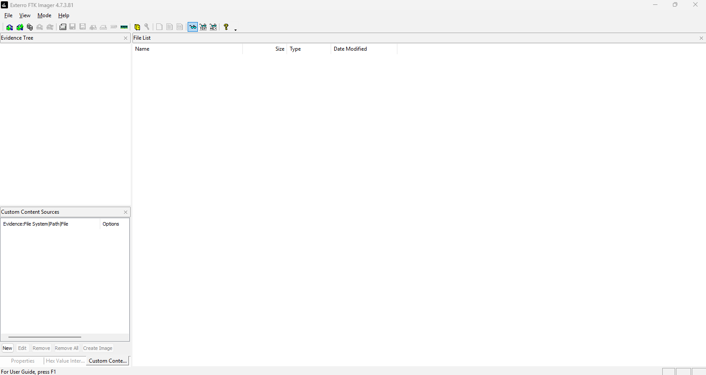

---

## Browser Artifact Extraction

The Google Chrome browser data directory was identified and selected for extraction.

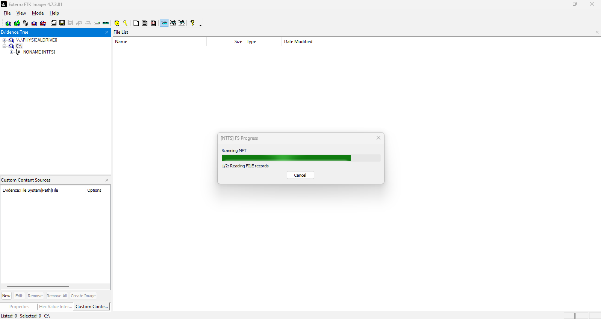

The extraction kept the browser files exactly as they were, so they'd stay reliable for analysis.

---

## Evidence Tree Examination

I looked through the evidence tree to find the Google Chrome data.

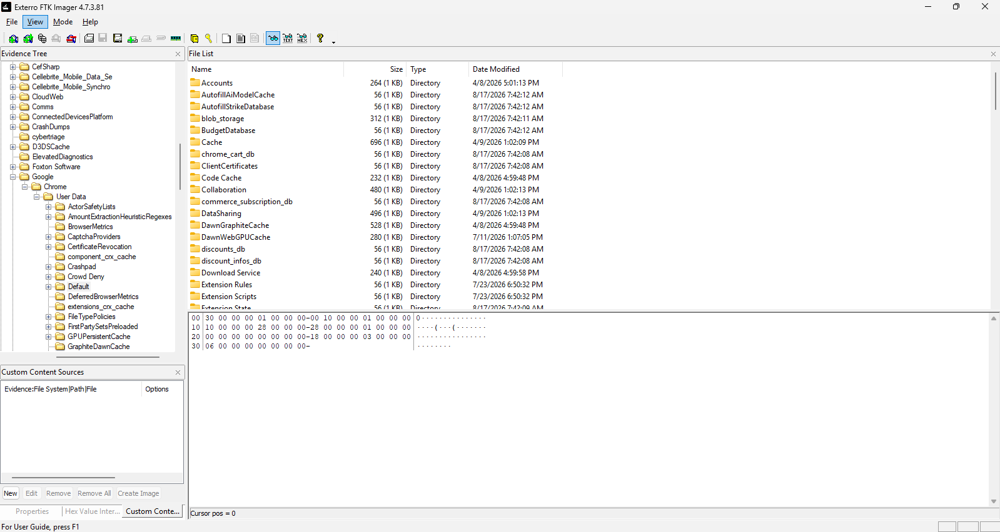

The browser profile structure revealed multiple artifacts containing historical user activity.

---

## Chrome Default Profile Artifacts

The Chrome "Default" profile had several databases worth examining.

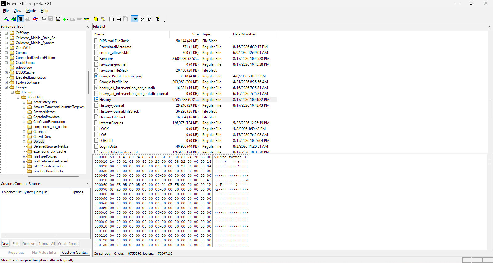

### Identified Artifacts

- BookmarkMergedSurfaceOrdering
- Favicons
- History
- Login Data
- Shortcuts
- Top Sites

Together, these files hold evidence about browsing history, saved logins, bookmarks, frequently visited sites, and general browsing habits.

---

# Phase 2: Evidence Integrity Verification

To keep the evidence trustworthy, I generated and checked hash values for every file I recovered.

---

## BookmarkMergedSurfaceOrdering

### Hash Generation

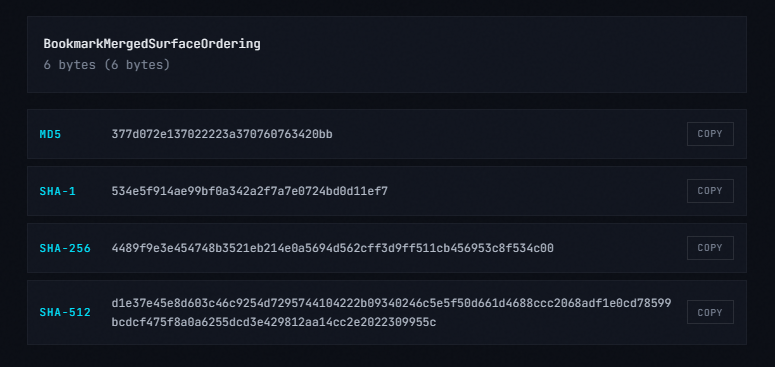

### Hash Verification

**Result:** MD5 Verification Successful

---

## Favicons

### Hash Generation

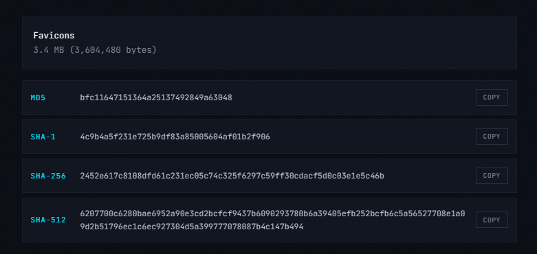

### Hash Verification

**Result:** MD5 Verification Successful

---

## History

### Hash Generation

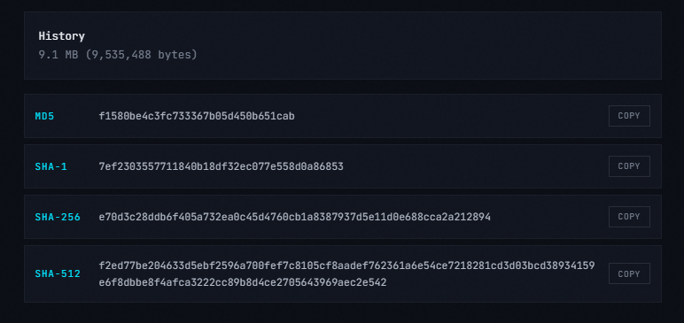

### Hash Verification

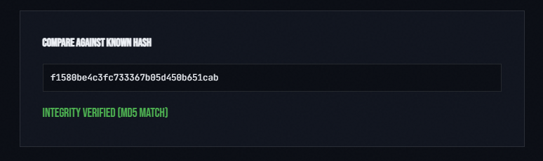

**Result:** MD5 Verification Successful

---

## Login Data

### Hash Generation

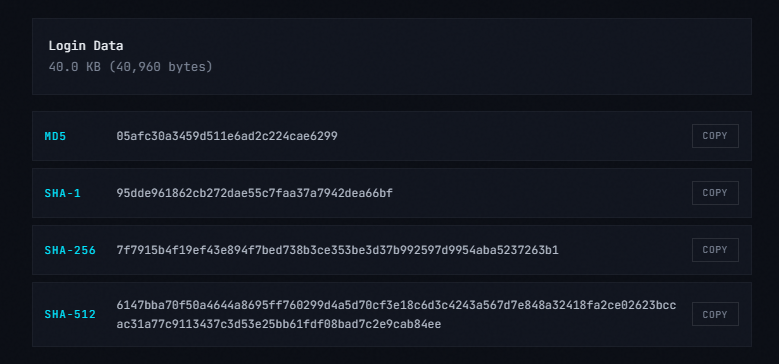

### Hash Verification

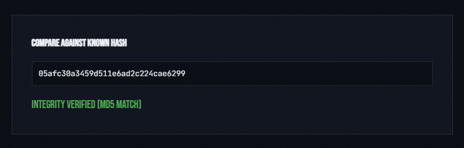

**Result:** MD5 Verification Successful

---

## Shortcuts

### Hash Generation

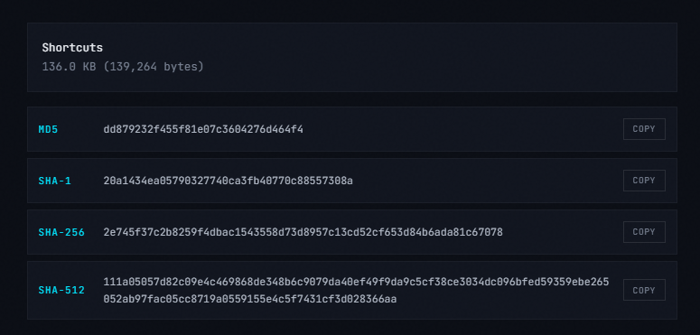

### Hash Verification

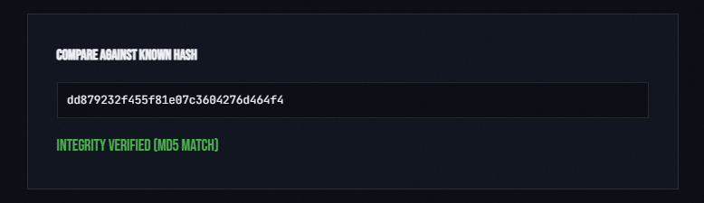

**Result:** MD5 Verification Successful

---

## Top Sites

### Hash Generation

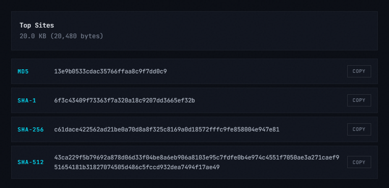

### Hash Verification

**Result:** MD5 Verification Successful

---

# Phase 3: Forensic Analysis Using Autopsy

## Ingest Configuration

I imported the recovered browser files into Autopsy and ran them through several forensic modules.

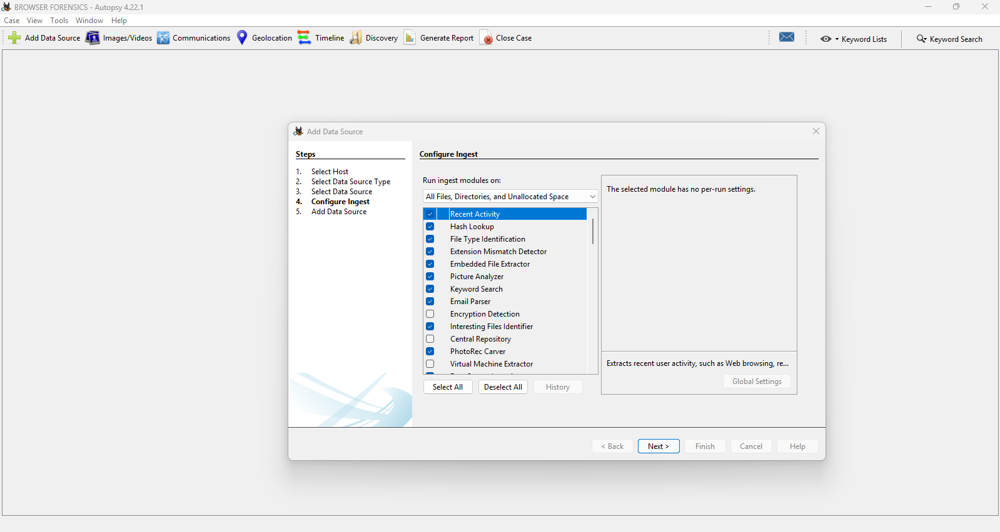

### Enabled Modules

- Recent Activity
- Keyword Search
- Hash Lookup
- File Type Identification
- Embedded File Extractor
- Interesting Files Identifier
- Email Parser
- Picture Analyzer

These modules helped me piece together the browser activity and spot useful artifacts.

---

## Evidence Successfully Loaded

The browser artifacts were successfully loaded into the Autopsy case.

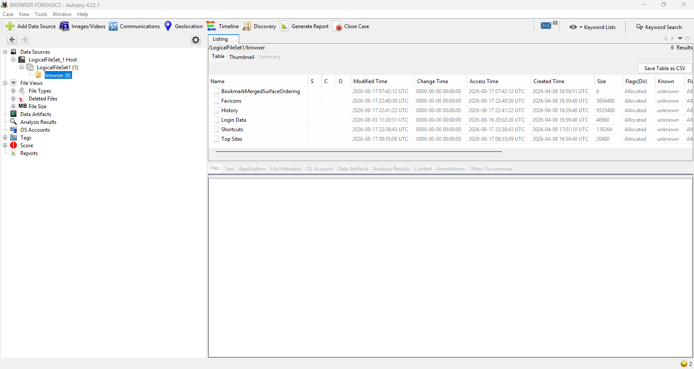

The evidence source contained browser databases associated with user browsing activity.

---

## Browser History Analysis

Autopsy parsed the browser history database and recovered thousands of browsing records.

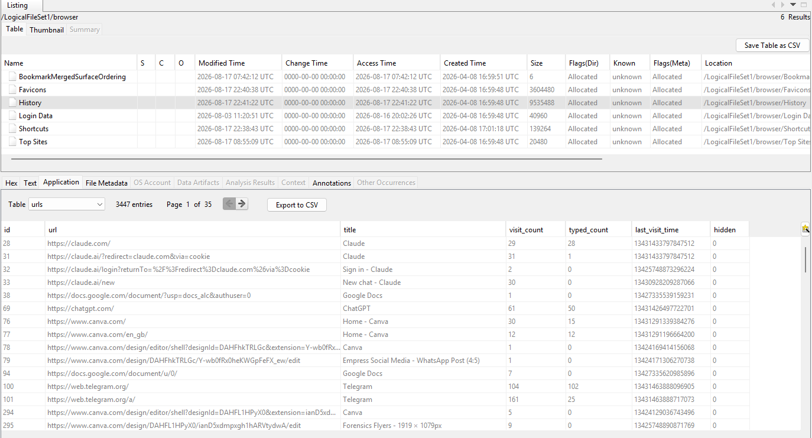

The recovered URLs revealed user activity involving:

- Artificial Intelligence platforms
- Cybersecurity resources
- Digital Forensics research
- Communication services
- Online productivity platforms

---

## Additional Browser History Records

Additional URL records were recovered from the browser history database.

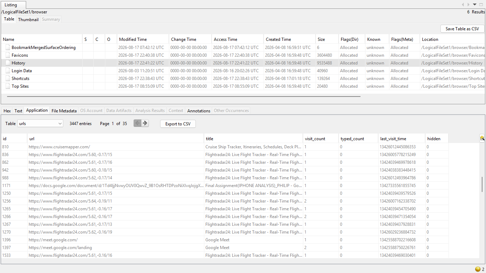

Examples included visits to:

- ChatGPT
- Claude AI
- Telegram Web
- Canva
- Google Docs
- Flightradar24

---

## Search Activity Analysis

Autopsy recovered keyword searches from browser artifacts.

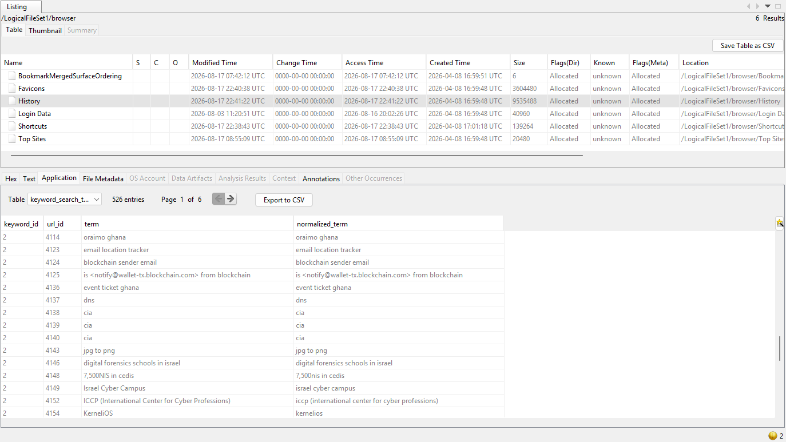

### Recovered Search Terms

- email location tracker
- blockchain sender email
- event ticket ghana
- dns
- cia
- jpg to png
- digital forensics schools in israel
- Israel Cyber Campus
- ICCP
- KerneliOS

### Observation

The recovered searches indicate interest in:

- Digital Forensics
- Cybersecurity
- Technical Research
- Professional Development

---

## SQLite Database Statistics

Browser database statistics were extracted from the History database.

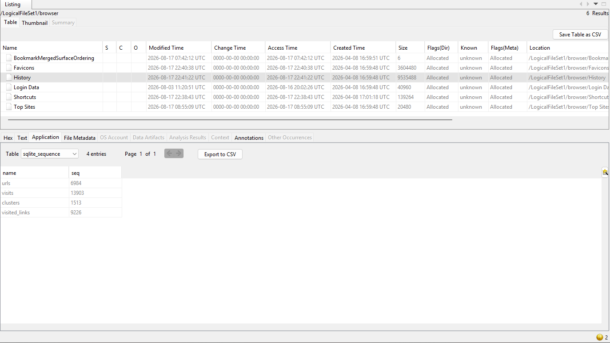

### Database Records

| Table | Records |
|---------|---------|
| URLs | 6,984 |
| Visits | 13,903 |
| Clusters | 1,513 |
| Visited Links | 9,226 |

These numbers show a lot of browsing activity built up over time.

---

## Top Sites Analysis

The Top Sites database identified the browser's most frequently visited websites.

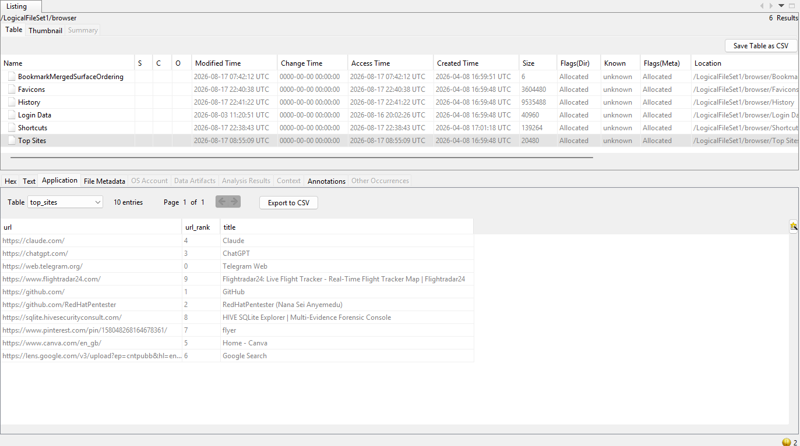
### Frequently Visited Websites

| Rank | Website |
|---------|---------|
| 1 | GitHub |
| 2 | RedHatPentester GitHub Profile |
| 3 | ChatGPT |
| 4 | Claude AI |
| 5 | Canva |
| 6 | Google Lens |
| 7 | Pinterest |
| 8 | HIVE SQLite Explorer |
| 9 | Flightradar24 |
| 10 | Telegram Web |

### Observation

The browser activity demonstrates regular interaction with:

- Open-source repositories
- AI platforms
- Design platforms
- Communication services
- Digital forensics resources

---

# Findings

## Finding 1

About 3,447 URL records were recovered from the browser history.

## Finding 2

Telegram Web was among the most frequently visited communication platforms.

## Finding 3

Artificial Intelligence platforms including ChatGPT and Claude AI were accessed regularly.

## Finding 4

Several searches were related to cybersecurity and digital forensics.

## Finding 5

Canva-related artifacts indicate content creation and graphic design activities.

## Finding 6

Google Docs and collaborative platforms were identified throughout browser history.

## Finding 7

Multiple visits to Flightradar24 suggest repeated flight-tracking activity.

## Finding 8

All examined browser artifacts successfully passed integrity verification checks.

---

# Conclusion

This examination successfully collected, preserved, verified, and analyzed Google Chrome browser data using FTK Imager and Autopsy.

Looking at the browsing history, search activity, top sites, and other browser databases showed heavy interaction of AI tools, cybersecurity resources, digital forensics learning material, messaging apps, productivity tools, and flight-tracking sites.

The evidence showed regular use of ChatGPT, Claude AI, Telegram Web, GitHub, Canva, Google Docs, and Flightradar24. The search activity also points to ongoing research into cybersecurity, digital forensics, and career development.

Hash verification confirmed that every artifact examined stayed unchanged, which supports the reliability of the findings in this report.

---

# Tools Used

- FTK Imager 4.7.3.8
- Autopsy 4.22.1

---

# Examiner

**Philip Oppong Adanse**  
Digital Forensics Examiner
