# USB Data Recovery & Forensic Analysis Using FTK Imager and Magnet AXIOM

## Table of Contents

- [Case Overview](#case-overview)
- [Investigation Details](#investigation-details)
- [Objective](#objective)
- [Chain of Custody](#chain-of-custody)
- [Tools Used](#tools-used)
- [Stage 1: Initial State of the USB Drive](#stage-1-initial-state-of-the-usb-drive)
- [Stage 2: Evidence Acquisition Using FTK Imager](#stage-2-evidence-acquisition-using-ftk-imager)
- [Stage 3: Creating a Magnet AXIOM Case](#stage-3-creating-a-magnet-axiom-case)
- [Stage 4: Adding Evidence Sources](#stage-4-adding-evidence-sources)
- [Stage 5: Evidence Processing](#stage-5-evidence-processing)
- [Stage 6: Case Overview and Recovery Results](#stage-6-case-overview-and-recovery-results)
- [Stage 7: File System Analysis](#stage-7-file-system-analysis)
- [Stage 8: Recovered Image Analysis](#stage-8-recovered-image-analysis)
- [Stage 9: Metadata Examination](#stage-9-metadata-examination)
- [Stage 10: Recovered Document Analysis](#stage-10-recovered-document-analysis)
- [Key Findings](#key-findings)
- [Conclusion](#conclusion)
- [Disclaimer](#disclaimer)

---

# Case Overview

This project shows how data can be recovered and examined from a USB flash drive that had been formatted. Even though the drive was formatted, forensic tools and methods were used to recover files, metadata, and device information that were still on the drive.

---

# Investigation Details

| Item | Description |
|--------|-------------|
| Examination Type | USB Data Recovery |
| Evidence Type | USB Flash Drive |
| File System | FAT32 |
| Acquisition Tool | FTK Imager |
| Analysis Tool | Magnet AXIOM |
| Image Format | E01 |
| Examiner | Philip Oppong Adanse |

---

# Objective

The objective of this examination was to:

- Recover data from a formatted USB storage device.
- Identify recoverable files and artifacts.
- Extract metadata from recovered files.
- Demonstrate the effectiveness of forensic recovery techniques.

---

# Chain of Custody

| Date | Action | Examiner |
|--------|---------|----------|
| August 2026 | USB drive received for examination |  Philip Oppong Adanse |
| August 2026 | Forensic image created using FTK Imager |  Philip Oppong Adanse |
| August 2026 | E01 image processed using Magnet AXIOM |  Philip Oppong Adanse |
| August 2026 | Artifacts recovered and documented | Philip Oppong Adanse |

---

# Tools Used

- FTK Imager
- Magnet AXIOM Process
- Magnet AXIOM Examine

---

# Stage 1: Initial State of the USB Drive

Before the examination began, the USB flash drive had already been formatted. The goal was to find out if any data could still be pulled off the drive.

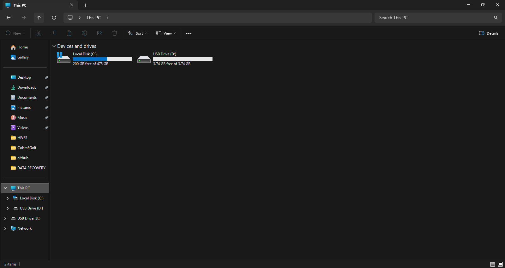

Formatting usually removes the file system's record of where files are, but it doesn't erase the actual data right away. Because of this, files can often still be recovered until new data overwrites them. In short: deleting data doesn't mean the data is really gone.

---

# Stage 2: Evidence Acquisition Using FTK Imager

I created a forensic image of the USB drive using FTK Imager v4.7.3.81.

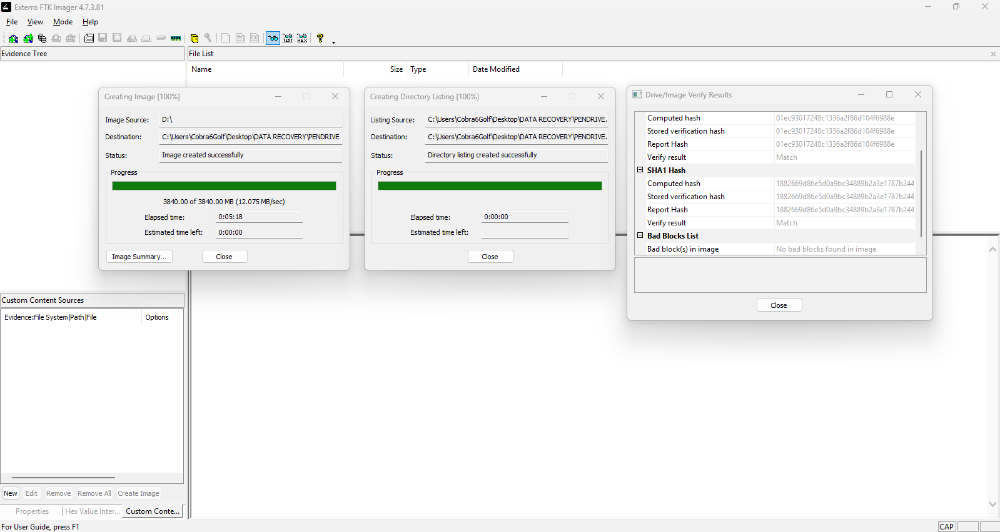

I selected the source device to begin the imaging process.

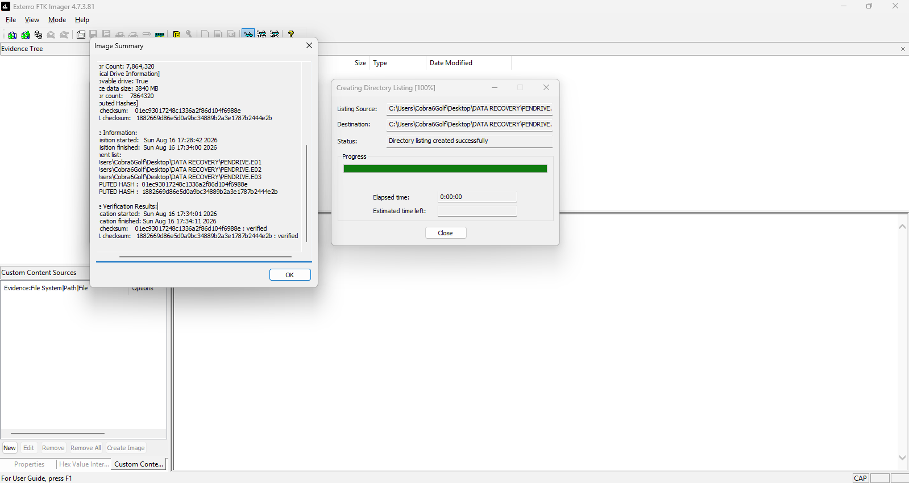

The imaging process finished successfully and the image was verified. No bad sectors were found.

### Acquisition Results

| Item | Value |
|--------|---------|
| Image Format | E01 |
| Verification | Successful |
| Bad Sectors | None |

---

# Stage 3: Creating a Magnet AXIOM Case

After acquiring the image, I created a new case in Magnet AXIOM to process it.

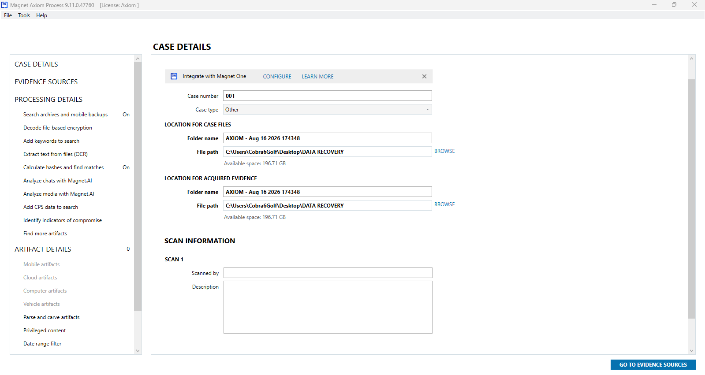

Before importing the image, I set up the case details and the workflow that would be used to process the evidence.

---

# Stage 4: Adding Evidence Sources

The forensic image was imported into Magnet AXIOM for analysis.

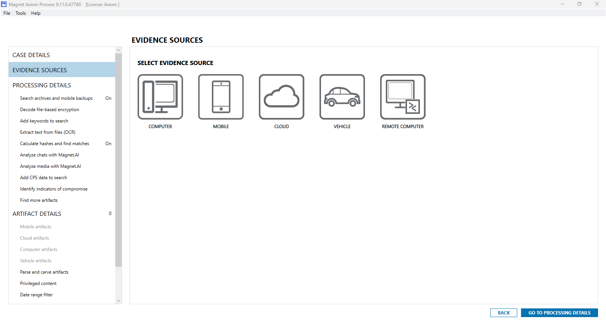

I selected the image file as the evidence source.

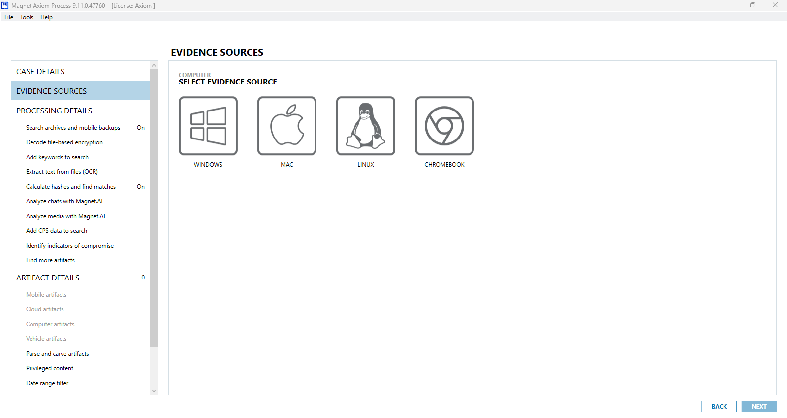

I then set up additional processing options.

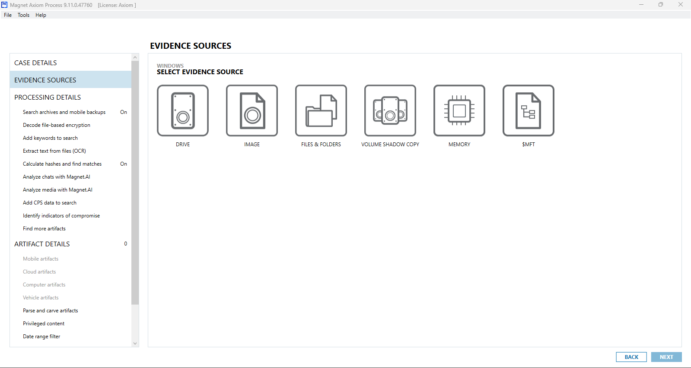

AXIOM showed the evidence source details for me to confirm before processing.

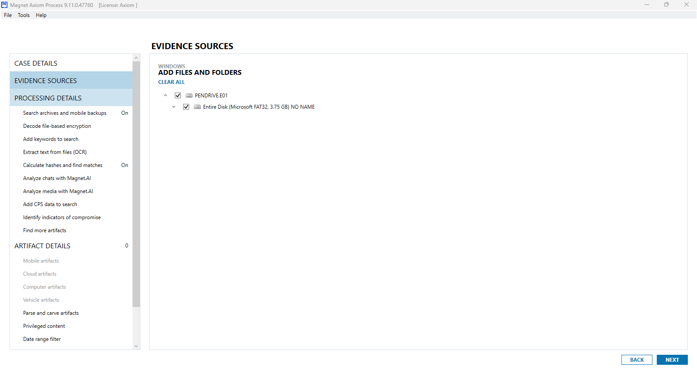

The evidence source was added successfully and lined up for examination.

---

# Stage 5: Evidence Processing

The forensic image was processed using Magnet AXIOM.

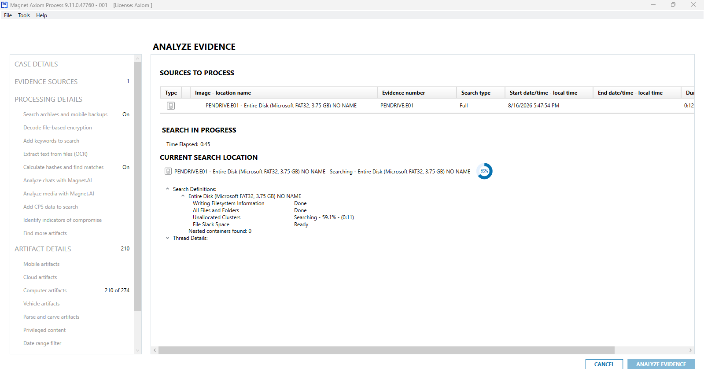

While processing, AXIOM read through the file system and checked both the visible space and the empty-looking space to find recoverable files.

---

# Stage 6: Case Overview and Recovery Results

Once processing was done, AXIOM created a summary of everything it recovered.

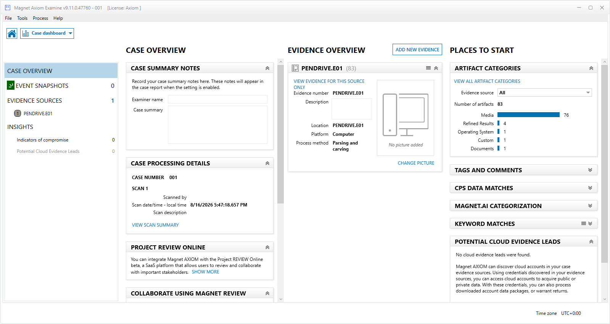

The analysis found several recoverable files, proving that formatting had not fully wiped the user data off the device.

---

# Stage 7: File System Analysis

I looked at the recovered file system details.

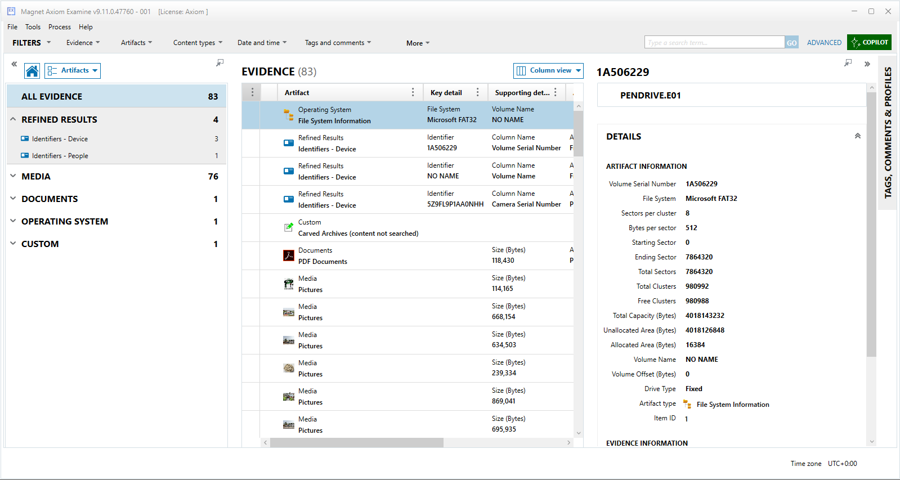

### Recovered Information

| Attribute | Value |
|------------|---------|
| File System | FAT32 |
| Volume Name | NO NAME |
| Volume Serial Number | 1A506229 |

The FAT32 structure could still be identified even after the drive was formatted.

---

# Stage 8: Recovered Image Analysis

AXIOM successfully recovered image files from the formatted USB drive.

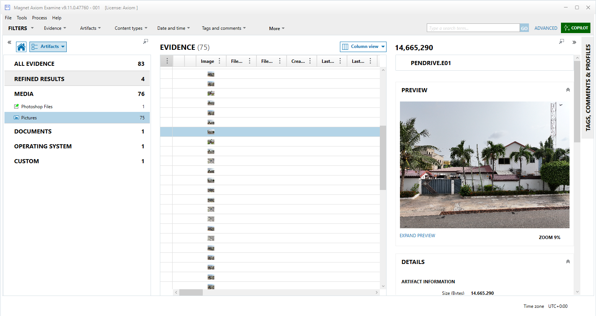

The recovered image could still be viewed and still had its metadata attached, which was useful for the analysis. This shows that photo content can survive even after a drive is formatted.

---

# Stage 9: Metadata Examination

I reviewed the metadata attached to the recovered files to find out more about the device and the files themselves.

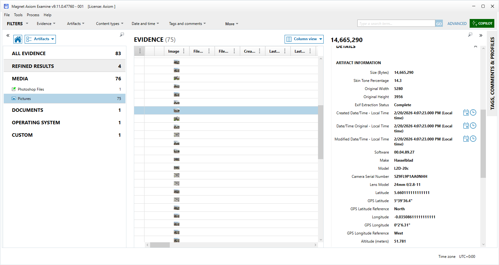

### Metadata Recovered

- Camera Manufacturer: Hasselblad
- Camera Model: L2D-20c
- Camera Serial Number: 5Z9FL9P1AA0NHH
- GPS Coordinates Present
- Timestamp Information Present

This metadata helped identify which device took the photo and where it was taken.

---

# Stage 10: Recovered Document Analysis

A PDF document was also recovered during the examination.

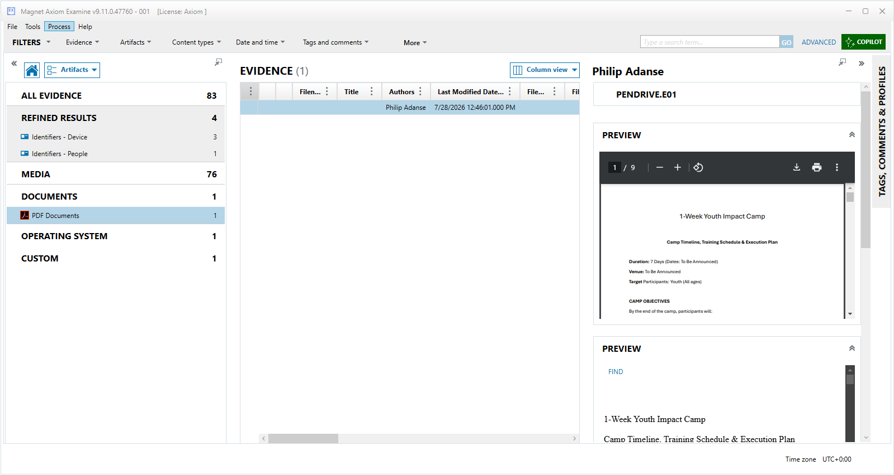

The recovered document still had its metadata, including who created it and when it was last changed. This shows that documents created by users can also survive a formatting operation.

---

# Key Findings

1. Formatting did not fully erase the data on the USB drive.

2. Several files could still be recovered from the drive.

3. The recovered images still had useful EXIF metadata attached.

4. GPS location data could be recovered from the image metadata.

5. Information identifying the camera used was recovered.

6. A PDF document was recovered after the drive was formatted.

7. File system details and device information were still available for examination.

---

# Conclusion

This examination shows that forensic recovery methods work well, even on storage media that has been formatted. Using FTK Imager and Magnet AXIOM, I was able to recover several files and artifacts from the USB drive, including photos, metadata, and documents.

The evidence recovered here shows why proper forensic acquisition and analysis matter and why it proves that formatting a drive is not a reliable way to permanently delete data.

---

# Disclaimer

This project was carried out in a controlled lab setting for training and educational purposes only. The USB drive used belonged to the examiner (Philip Oppong Adanse) and was authorized for this analysis. The findings in this case study are meant only to show forensic recovery methods, and should not be read as anything beyond this training exercise.
