# Email Forensics: Phishing Email Investigation

## Table of Contents

- [Overview](#overview)
- [Case Information](#case-information)
- [Investigation Objectives](#investigation-objectives)
- [Tools Used](#tools-used)
- [Stage 1: Suspicious Email Identification](#stage-1-suspicious-email-identification)
- [Stage 2: Evidence Acquisition and Hashing](#stage-2-evidence-acquisition-and-hashing)
- [Stage 3: Evidence Verification](#stage-3-evidence-verification)
- [Stage 4: Email Header Examination](#stage-4-email-header-examination)
- [Stage 5: Initial Header Analysis](#stage-5-initial-header-analysis)
- [Stage 6: Authentication Analysis](#stage-6-authentication-analysis)
- [Stage 7: Sender Verification](#stage-7-sender-verification)
- [Stage 8: Email Routing Analysis](#stage-8-email-routing-analysis)
- [Stage 9: Detailed Header Analysis](#stage-9-detailed-header-analysis)
- [Stage 10: Advanced Header Review](#stage-10-advanced-header-review)
- [Stage 11: Spoofing Assessment](#stage-11-spoofing-assessment)
- [Stage 12: Source Infrastructure Investigation](#stage-12-source-infrastructure-investigation)
- [Stage 13: Infrastructure Correlation](#stage-13-infrastructure-correlation)
- [Indicators of Compromise (IOCs)](#indicators-of-compromise-iocs)
- [Findings](#findings)
- [Conclusion](#conclusion)
- [Lessons Learned](#lessons-learned)

---

# Overview

This project shows how I investigated a phishing email that pretended to be a real Google security alert. The goal was to find out if the email was real, spot signs of phishing, check how the sender was authenticated, trace where the email actually came from, and pull out indicators of compromise (IOCs).

I used forensic methods that are commonly used when investigating email security incidents and phishing attacks..

---

# Case Information

| Item | Value |
|--------|--------|
| Case ID | DEIL-EMAIL-001 |
| Investigation Type | Email Forensics |
| Evidence Type | EML File |
| Subject | Your Account has been locked on Tue,04 Aug-2026. Your photos and videos will be removed! |
| Recipient | padanse92@gmail.com |
| Status | Confirmed Phishing Email |
| Examiner | Philip Oppong Adanse |

---

# Investigation Objectives

- Keep the original email safe and unchanged..
- Confirm the evidence hadn't been altered.
- Look closely at the email headers.
- Check the SPF, DKIM, and DMARC records.
- Find out if the sender was spoofed (faked).
- Trace how the email was routed.
- Investigate where the email actually came from..
- Pull out indicators of compromise.
- Decide whether the email was malicious.

---

# Tools Used

| Tool | Purpose |
|--------|--------|
| HIVE Email Analyzer | Email Header Analysis |
| MXToolbox Header Analyzer | Header Parsing |
| Cipher Cloud Investigation Platform | IOC Correlation |
| IP Lookup Services | Infrastructure Attribution |
| Hash Verification Tool | Integrity Verification |

---

# Stage 1: Suspicious Email Identification

The investigation started with a suspicious email claiming the recipient's Gmail account had been locked, and that their photos and videos would be deleted unless they acted right away.

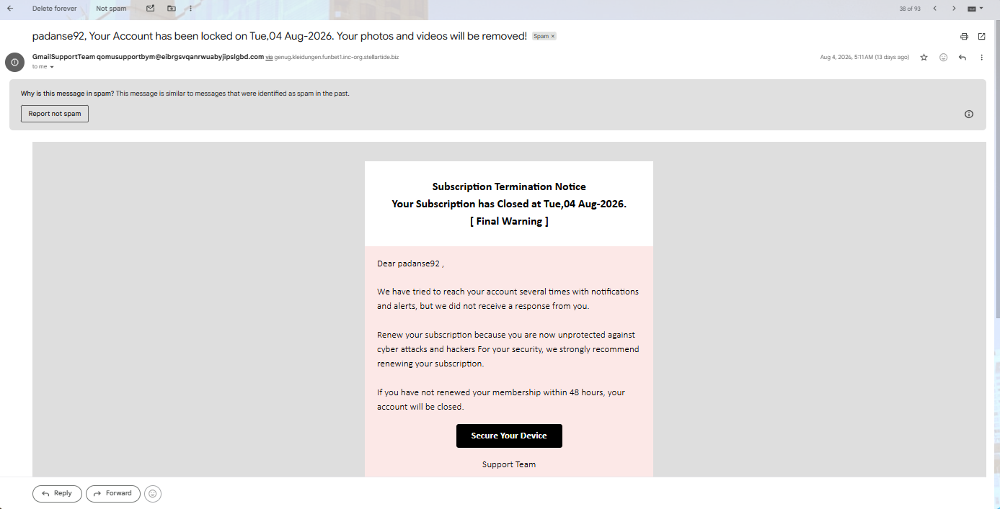


### Initial Observations

- Urgent, pressuring language.
- Uses fear to manipulate the reader.
- Threatens to suspend the account..
- Requests for immediate action.
- Claims to be from a Google support team.

These are common tricks used in phishing emails, they're designed to make people panic and click without thinking.

---

# Stage 2: Evidence Acquisition and Hashing

I saved the email in EML format so I could keep the original metadata and headers intact for analysis. I then generated hash values to make sure the evidence stayed unchanged throughout the investigation.

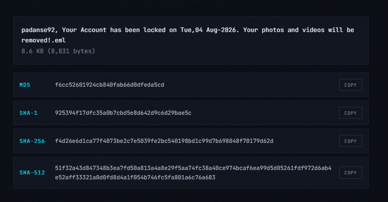

### Generated Hashes

| Algorithm | Value |
|------------|---------|
| MD5 | f6cc52601924cb840fab66d0dfeda5cd |
| SHA1 | 925394f17dfc35a0b7cbd5e8d642d9c6d29bae5c |
| SHA256 | f4d26e6d1ca77f4073be2c7e5039fe2bc540198bd1c99d7b698048f70179d62d |

---

# Stage 3: Evidence Verification

I checked the hashes again to make sure they still matched the original values.

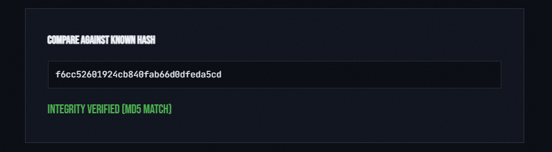

### Result

Hash Match Confirmed

### Finding

The evidence stayed exactly the same from acquisition through to analysis and nothing was changed.

---

# Stage 4: Email Header Examination

The original email header was extracted and reviewed to identify sender information, authentication records, routing details, and other metadata.

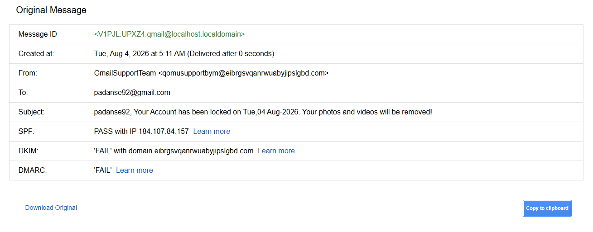

### Header Information Identified

- Sender Address
- Recipient Address
- Message-ID
- Return-Path
- Received Headers
- SPF Results
- DKIM Results
- DMARC Results

Email headers are full of useful forensic clues, a lot of this information isn't visible in a normal inbox view.

---

# Stage 5: Initial Header Analysis

I ran the extracted header through an email header analysis tool.

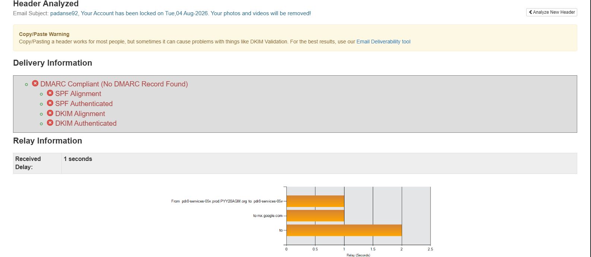

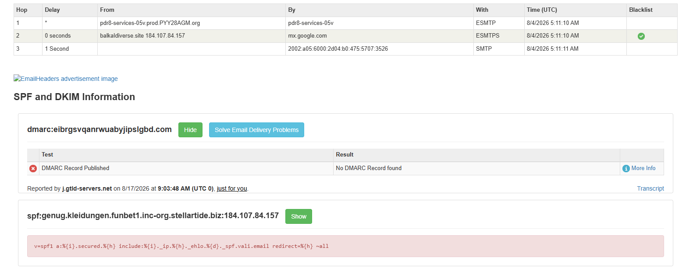

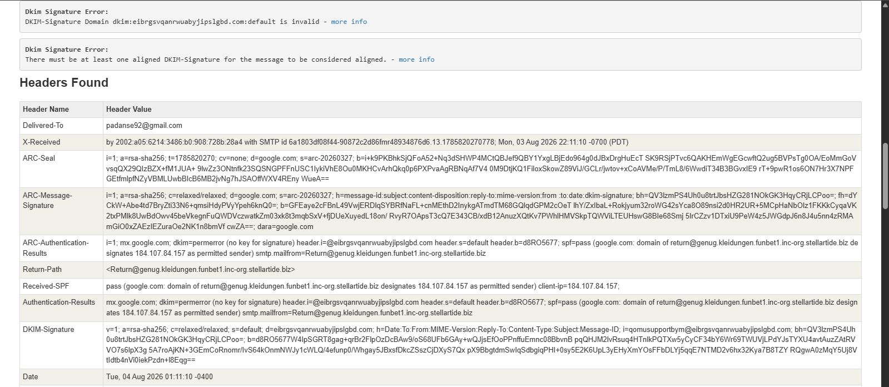

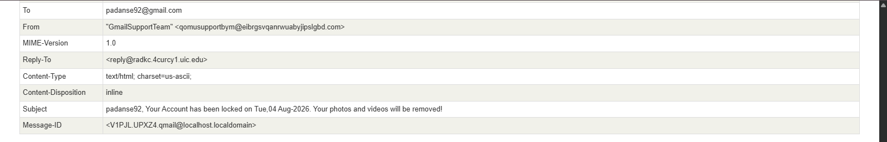


### Findings

| Field | Value |
|---------|---------|
| Sender | qomusupportbym@eibrgsvqanrwuabyjipslgbd.com |
| Recipient | padanse92@gmail.com |
| Subject | Account Locked |
| Authentication | Mixed Results |

The sender domain immediately appeared suspicious and did not resemble a legitimate Google-owned domain.

---

# Stage 6: Authentication Analysis

I checked the authentication results to see if the sender could be trusted.


### Results

| Authentication Control | Result |
|------------------------|---------|
| SPF | PASS |
| DKIM | FAIL |
| DMARC | FAIL |

### Analysis

SPF passing doesn't mean much on its own. DKIM and DMARC both failed, which is a strong sign that the sender was spoofed or the domain was being misused.

---

# Stage 7: Sender Verification

Further sender verification was performed using the available header data.


### Findings

- The sender's domain looks randomly generated.
- The naming doesn't match how Google names its domains.
- Authentication alignment issues identified.
- Several other suspicious details showed up.

### Observation

Real companies usually stick to consistent, recognizable domains. Phishing emails, on the other hand, often use random or newly-made-up domains.

---

# Stage 8: Email Routing Analysis

I rebuilt the email's route using the Received headers.


### Routing Information

The message passed through several mail servers before it reached Gmail.

### Significance

Looking at the routing, it helps investigators trace exactly how a message traveled and which infrastructure was used to send it.

---

# Stage 9: Detailed Header Analysis

A deeper analysis was performed on the message authentication chain.

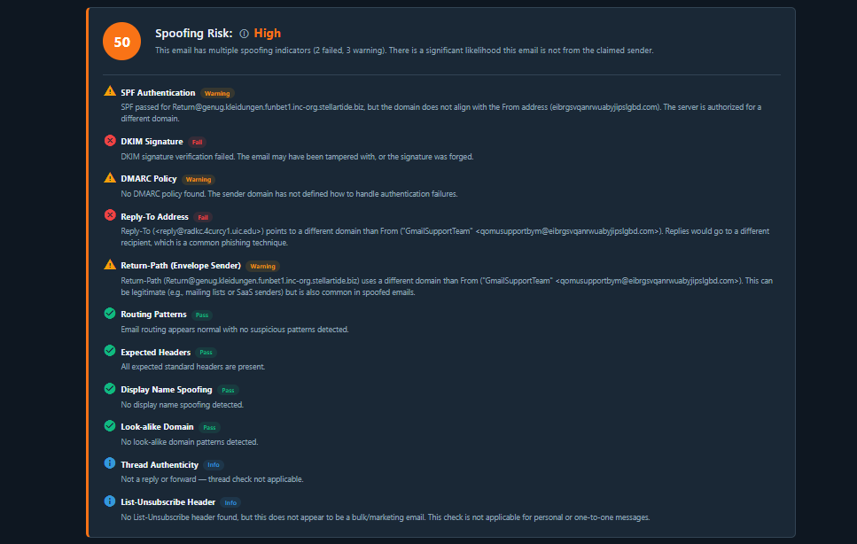

### Findings

- Found inconsistencies in the authentication data.
- Domain alignment failed.
- Couldn't confirm the sender was legitimate.
- Found other odd details in the headers.

All of this makes it more likely the email came from an unauthorized source.

---

# Stage 10: Advanced Header Review

I focused more on the sender, reply-to, and return-path fields.

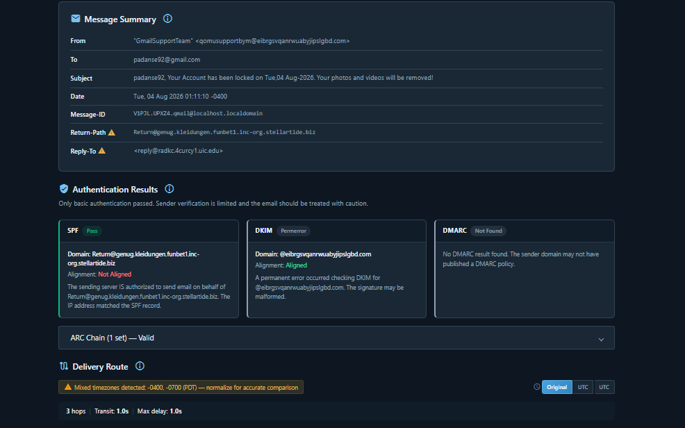

### Suspicious Indicators

#### Sender

```text
qomusupportbym@eibrgsvqanrwuabyjipslgbd.com
```

#### Reply-To

```text
reply@radkc.4curcy1.uic.edu
```

#### Return-Path

```text
return@genug.kleidungen.funbet1.inc-org.stellartide.biz
```

### Observation

Three separate domains were identified within critical email headers. Legitimate companies almost never mix unrelated domains like this.

---

# Stage 11: Spoofing Assessment

The message was assessed for spoofing indicators.

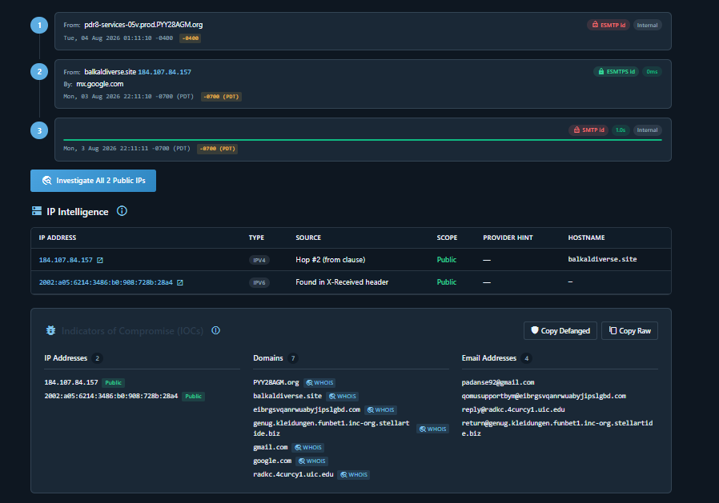

### Risk Assessment

| Category | Result |
|------------|---------|
| Spoofing Risk | High |
| DKIM Status | Failed |
| DMARC Status | Failed |
| Sender Alignment | Failed |

### Conclusion

The collected indicators strongly suggest sender impersonation.

---

# Stage 12: Source Infrastructure Investigation

I looked up the originating IP address the email came from to find out who was hosting it.

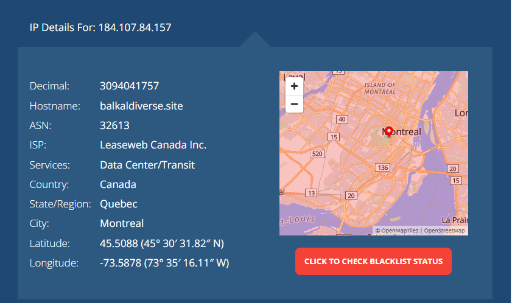

### Infrastructure Information

| Field | Value |
|---------|---------|
| IP Address | 184.107.84.157 |
| Country | Canada |
| Province | Quebec |
| City | Montreal |
| ISP | Leaseweb Canada Inc |
| Infrastructure Type | Data Center |

### Observation

This infrastructure has no connection to Google whatsoever.

---

# Stage 13: Infrastructure Correlation

Additional analysis was performed using a threat intelligence platform.

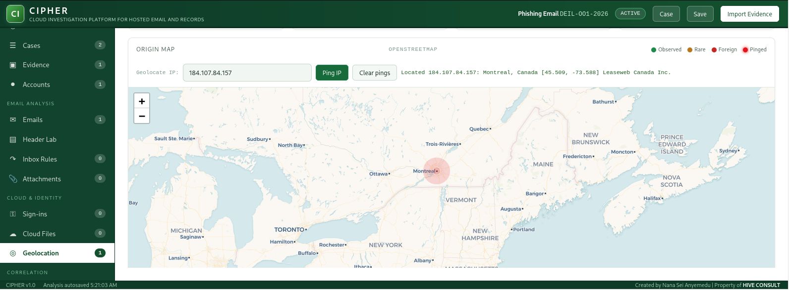

### Findings

- Found several more spoofing signs
- Authentication failures confirmed.
- Still couldn't confirm the sender was real.
- Confirmed a high phishing risk.

The additional analysis supported earlier findings obtained during header examination.

---

# Indicators of Compromise (IOCs)

## IP Addresses

```text
184.107.84.157
2002:a05:6214:3486:b0:908:728b:28a4
```

## Domains

```text
eibrgsvqanrwuabyjipslgbd.com
balkaldiverse.site
radkc.4curcy1.uic.edu
genug.kleidungen.funbet1.inc-org.stellartide.biz
```

## Email Addresses

```text
qomusupportbym@eibrgsvqanrwuabyjipslgbd.com
reply@radkc.4curcy1.uic.edu
return@genug.kleidungen.funbet1.inc-org.stellartide.biz
```

---

# Findings

1. The email was pretending to be a real Google account security alert.

2. The sender's domain had no connection to Google.

3. SPF passed but did not establish legitimacy.

4. DKIM validation failed.

5. DMARC validation failed.

6. Sender alignment issues were identified.

7. Multiple unrelated domains were present within sender-related headers.

8. The Reply-To and Return-Path didn't match the visible sender address.

9. The email was traced back to a hosting provider in Canada.

10. Multiple phishing indicators were identified throughout the investigation.

---

# Conclusion

After reviewing the headers, verifying the sender, checking authentication, rebuilding the routing, investigating the infrastructure, and cross-checking threat intelligence, I confirmed this email was phishing.

The message used classic social engineering tricks to create urgency to push the recipient into acting fast. The failed authentication checks, suspicious sender domains, mismatched headers, and the hosting infrastructure all point to the same conclusion that this email did not come from a real Google service.

---

# Lessons Learned

- SPF passing alone doesn't prove an email is legitimate.
- DKIM and DMARC should always be validated.
- Reply-To and Return-Path fields should be examined during investigations.
- Email headers often reveal things regular users never see.
- Tracing infrastructure can add important context to a phishing case.
- Always keep the original EML file safe during a forensic examination.

---

## Author

**Philip Oppong Adanse**
  
