# Email Forensics: Legitimate Email Investigation

## Table of Contents

- [Overview](#overview)
- [Case Information](#case-information)
- [Investigation Objectives](#investigation-objectives)
- [Tools Used](#tools-used)
- [Stage 1: Email Identification](#stage-1-email-identification)
- [Stage 2: Original Message Verification](#stage-2-original-message-verification)
- [Stage 3: Evidence Acquisition and Hashing](#stage-3-evidence-acquisition-and-hashing)
- [Stage 4: Evidence Verification](#stage-4-evidence-verification)
- [Stage 5: Email Header Examination](#stage-5-email-header-examination)
- [Stage 6: Initial Header Analysis](#stage-6-initial-header-analysis)
- [Stage 7: Authentication Analysis](#stage-7-authentication-analysis)
- [Stage 8: Header Verification](#stage-8-header-verification)
- [Stage 9: Advanced Email Analysis](#stage-9-advanced-email-analysis)
- [Stage 10: Authentication Review](#stage-10-authentication-review)
- [Stage 11: Delivery Route Analysis](#stage-11-delivery-route-analysis)
- [Stage 12: Indicators Review](#stage-12-indicators-review)
- [Stage 13: IP Infrastructure Investigation](#stage-13-ip-infrastructure-investigation)
- [Stage 14: Infrastructure Correlation](#stage-14-infrastructure-correlation)
- [Indicators of Interest](#indicators-of-interest)
- [Findings](#findings)
- [Conclusion](#conclusion)
- [Lessons Learned](#lessons-learned)

---

# Overview

This project shows how I investigated a real marketing email sent by Spotify. The goal was to check if the email really came from Spotify, confirm the authentication controls worked properly, review how the email was routed, verify who owned the sending infrastructure, and compare it against the kind of red flags you'd see in a phishing email.

Unlike the last investigation (the phishing one), this one focuses on showing what a legitimate email looks like and how proper sender authentication should check out.

---

# Case Information

| Item | Value |
|--------|--------|
| Case ID | DEIL-EMAIL-002 |
| Investigation Type | Email Forensics |
| Evidence Type | EML File |
| Subject | 1 month of Premium, on us. Offline listening included. |
| Sender | Spotify <no-reply@spotify.com> |
| Recipient | padanse92@gmail.com |
| Status | Confirmed Legitimate Email |
| Examiner | Philip Oppong Adanse |

---

# Investigation Objectives

- Keep the original email safe and unchanged
- Verify evidence integrity through hashing.
- Examine email headers.
- Validate SPF authentication.
- Validate DKIM authentication.
- Check that DMARC lined up correctly.
- Confirm the sender was legitimate.
- Trace the delivery infrastructure.
- Identify any spoofing indicators.
- Determine whether the email is genuine.

---

# Tools Used

| Tool | Purpose |
|--------|--------|
| HIVE Email Analyzer | Email Header Analysis |
| MXToolbox Header Analyzer | Header Parsing |
| Cipher Cloud Investigation Platform | IOC Correlation |
| IP Lookup Services | Infrastructure Attribution |
| Hash Verification Tool | Integrity Verification |

---

# Stage 1: Email Identification

The investigation began with an email advertising a promotional Spotify Premium subscription offer.

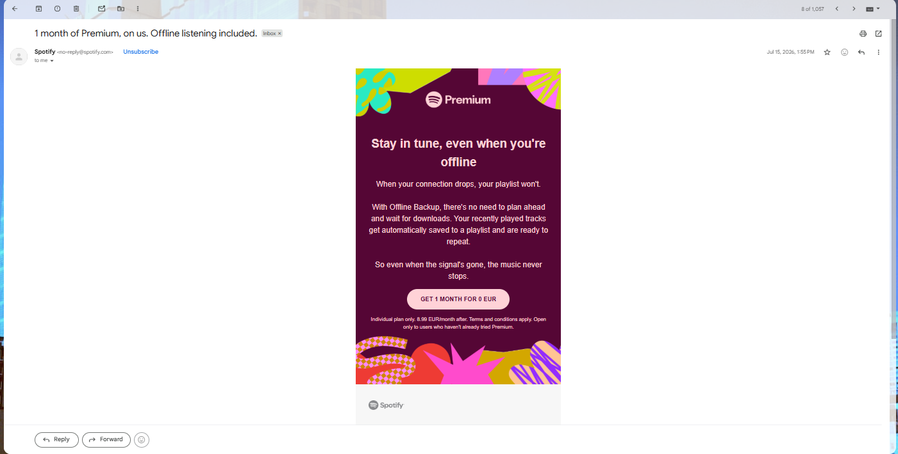

### Initial Observations

- Familiar Spotify branding.
- Professional formatting.
- No urgent threats or scare tactics.
- Clear promotional purpose.
- Sender identity stayed consistent.

### Observation

Right away, this email looked like a normal marketing campaign from Spotify.

---

# Stage 2: Original Message Verification

The original Gmail message details were reviewed before extraction.

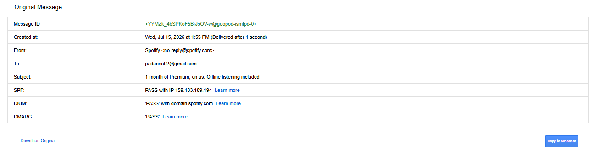

### Header Summary

| Field | Value |
|---------|---------|
| Sender | no-reply@spotify.com |
| Recipient | padanse92@gmail.com |
| SPF | PASS |
| DKIM | PASS |
| DMARC | PASS |

### Finding

All the authentication checks passed even before I dug deeper.

---

# Stage 3: Evidence Acquisition and Hashing

I exported the email as an EML file and generated hash values for it.

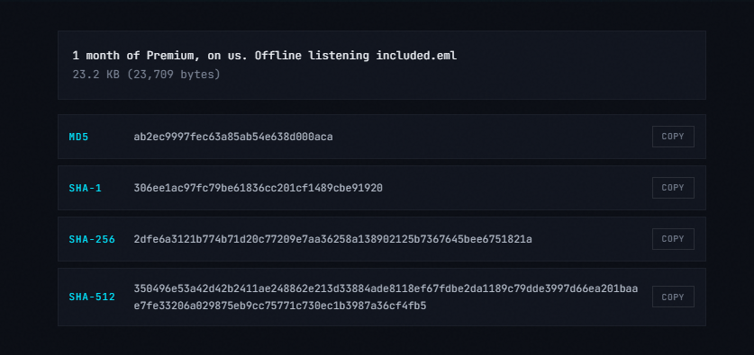

### Generated Hashes

| Algorithm | Value |
|------------|---------|
| MD5 | ab2ec9997fec63a85ab54e638d000aca |
| SHA1 | 306ee1ac97fc79be61836cc201cf1489cbe91920 |
| SHA256 | 2dfe6a3121b774b71d20c77209e7aa36258a138902125b7367645bee6751821a |

### Significance

Hashing ensures the evidence hasn't been altered with or remains unchanged throughout the investigation.

---

# Stage 4: Evidence Verification

I compared the hashes I generated against the original values.

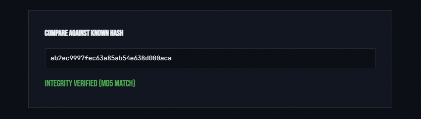

### Result

Integrity Verified (MD5 Match)

### Finding

The evidence hadn't changed at all after it was collected.

---

# Stage 5: Email Header Examination

The complete email header was extracted for forensic analysis.

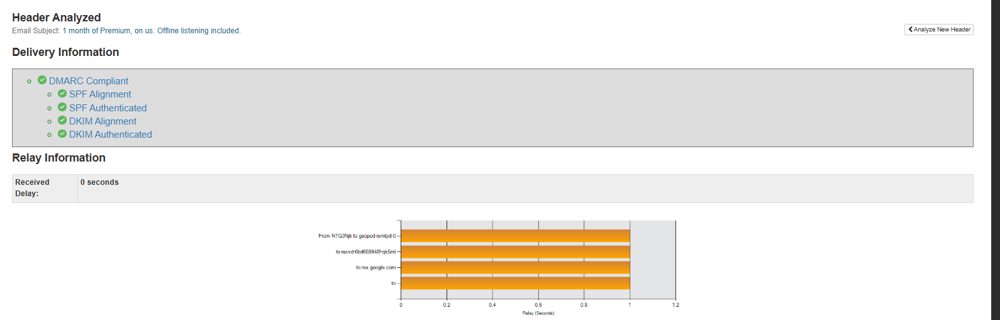

### Header Information Identified

- Message-ID
- From Address
- Return-Path
- SPF Records
- DKIM Signatures
- DMARC Policies
- Routing Information
- ARC Authentication Records

### Observation

The header had a lot of authentication data and thats the kind you'd normally expect from a legitimate bulk marketing email.

---

# Stage 6: Initial Header Analysis

The extracted header was analyzed using a header analysis platform.

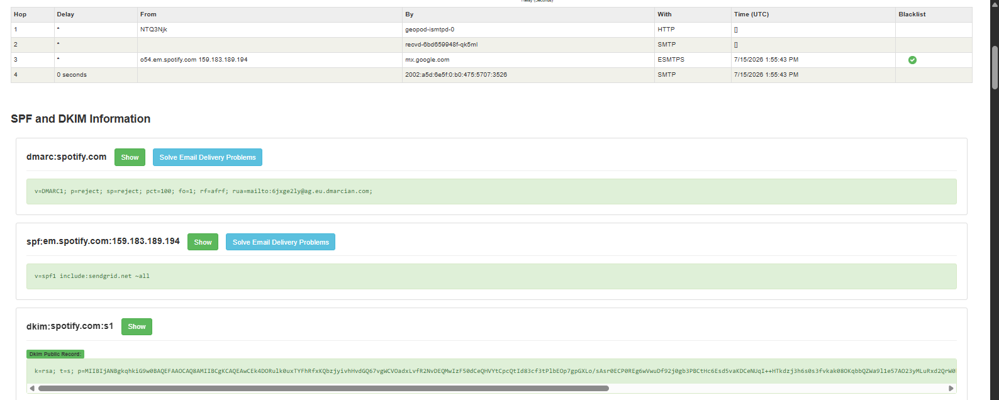

### Authentication Results

| Control | Status |
|----------|----------|
| SPF Alignment | PASS |
| SPF Authentication | PASS |
| DKIM Alignment | PASS |
| DKIM Authentication | PASS |
| DMARC Compliance | PASS |

### Finding

All major authentication mechanisms successfully passed.

---

# Stage 7: Authentication Analysis

I took a closer look at the SPF, DKIM, and DMARC records.

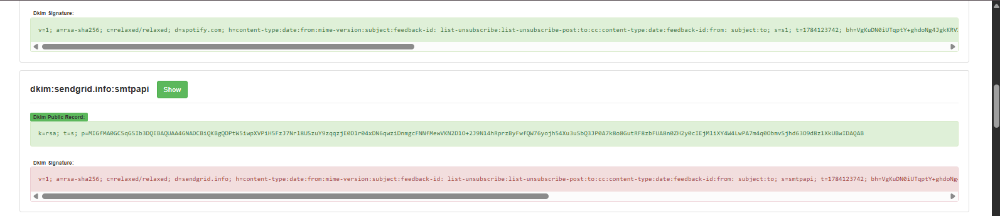

### Findings

#### DMARC

```text
dmarc.spotify.com
```

#### SPF

```text
spf.em.spotify.com
```

#### DKIM

```text
dkim.spotify.com
```

### Observation

All the authentication records matched up correctly with Spotify's own infrastructure.

---

# Stage 8: Header Verification

Additional header validation was performed.

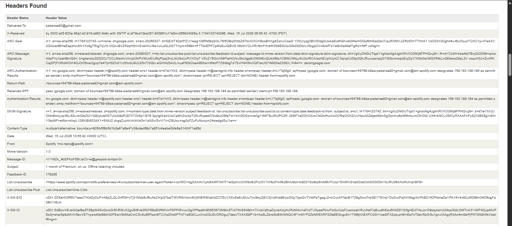

### Verified Fields

- From Address
- Return-Path
- Message-ID
- Feedback-ID
- List-Unsubscribe
- ARC Authentication Results

### Finding

The sender's identity stayed consistent across every important header field.

---

# Stage 9: Advanced Email Analysis

An advanced forensic review was performed.

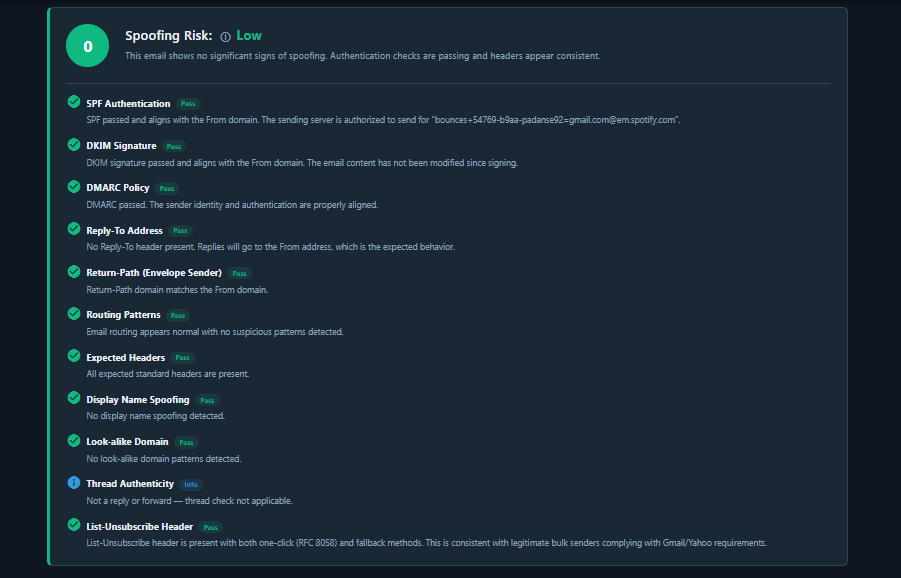

### Spoofing Assessment

| Category | Result |
|------------|---------|
| SPF | PASS |
| DKIM | PASS |
| DMARC | PASS |
| Reply-To Validation | PASS |
| Return-Path Validation | PASS |
| Routing Consistency | PASS |
| Spoofing Risk | LOW |

### Conclusion

No spoofing indicators were identified.

---

# Stage 10: Authentication Review

I dug deeper into the authentication chain.

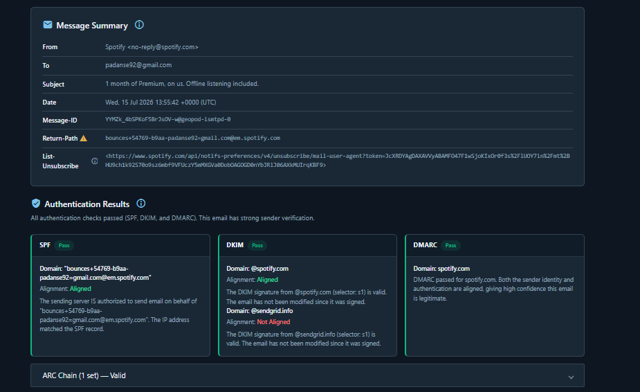

### Findings

- SPF authentication successful.
- DKIM signature validated.
- DMARC policy passed.
- ARC authentication passed.
- Sender alignment confirmed.

### Observation

All of this strongly shows the email really did come from Spotify's own systems.

---

# Stage 11: Delivery Route Analysis

The delivery route was reconstructed from Received headers.

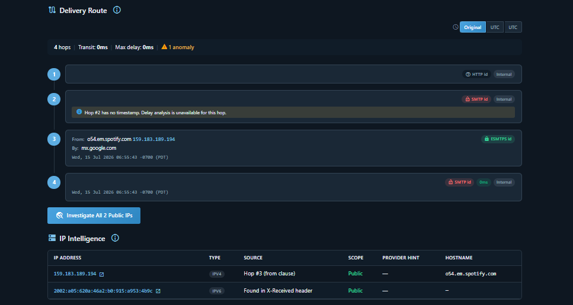

### Routing Information

| Hop | Infrastructure |
|------|----------------|
| 1 | Internal Spotify Platform |
| 2 | Internal Mail Processing |
| 3 | o54.em.spotify.com |
| 4 | Gmail Infrastructure |

### Observation

The route followed a normal delivery pattern without suspicious relays.

---

# Stage 12: Indicators Review

I reviewed the indicators pulled from the message.

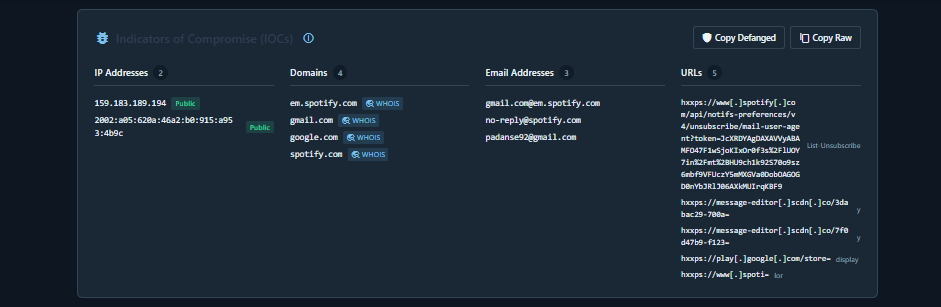

### Domains Identified

```text
spotify.com
em.spotify.com
google.com
gmail.com
```

### Email Addresses

```text
no-reply@spotify.com
padanse92@gmail.com
```

### Finding

All identified domains belonged to legitimate and trusted providers.

---

# Stage 13: IP Infrastructure Investigation

I looked up the public IP address the email came from.

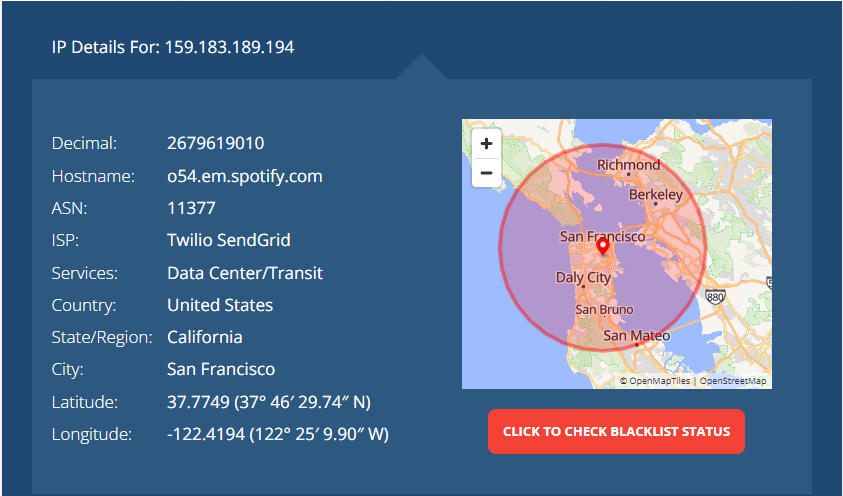

### Infrastructure Information

| Field | Value |
|---------|---------|
| IP Address | 159.183.189.194 |
| Hostname | o54.em.spotify.com |
| ASN | 11377 |
| Provider | Twilio SendGrid |
| Country | United States |
| State | California |
| City | San Francisco |
| Infrastructure Type | Data Center |

### Observation

Spotify uses Twilio SendGrid, a legitimate email delivery service, to send its emails.

---

# Stage 14: Infrastructure Correlation

The infrastructure was further validated through threat intelligence correlation.

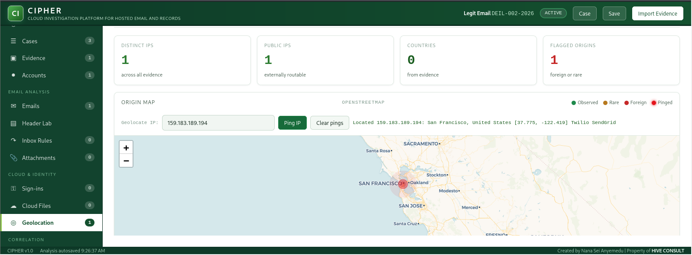

### Findings

- IP geolocated to San Francisco.
- Infrastructure attributed to Twilio SendGrid.
- No malicious indicators identified.
- No phishing indicators detected.
- Infrastructure consistent with legitimate email delivery.

### Conclusion

Infrastructure analysis supported all previous findings.

---

# Indicators of Interest

## IP Addresses

```text
159.183.189.194
2002:a05:620a:46a2:b0:915:a953:4b9c
```

## Domains

```text
spotify.com
em.spotify.com
google.com
gmail.com
```

## Email Addresses

```text
no-reply@spotify.com
padanse92@gmail.com
```

---

# Findings

1. The email originated from Spotify.

2. SPF authentication passed successfully.

3. DKIM authentication passed successfully.

4. DMARC validation passed successfully.

5. Sender alignment was verified.

6. ARC authentication records validated successfully.

7. The sender's domain matched Spotify's own infrastructure.

8. The Return-Path matched Spotify's email systems.

9. The email was delivered through Twilio SendGrid.

10. No spoofing indicators were identified.

11. No phishing characteristics were observed.

12. The message followed a legitimate delivery route.

---

# Conclusion

After checking the headers, authentication controls, routing, infrastructure ownership, and threat intelligence data, I confirmed this email was legitimate.

Unlike phishing emails which usually have failed authentication, mismatched domains, faked identities, and shady infrastructure, this email passed SPF, DKIM, DMARC, and ARC checks properly. The infrastructure traced back to Twilio SendGrid, a service Spotify is authorized to use.

Based on everything I found, this was a genuine marketing email sent on behalf of Spotify.

---

# Lessons Learned

- SPF, DKIM, and DMARC together give strong proof that a sender is genuine.
- Domain alignment matters a lot when assessing legitimacy.
- Legitimate companies keep their sender identity consistent.
- Checking who owns the infrastructure can confirm a sender's claims.
- Routing analysis helps you tell real mail apart from spoofed mail.
- Email authentication records are some of the most valuable clues in email forensics.

---

## Author

**Philip Oppong Adanse**
