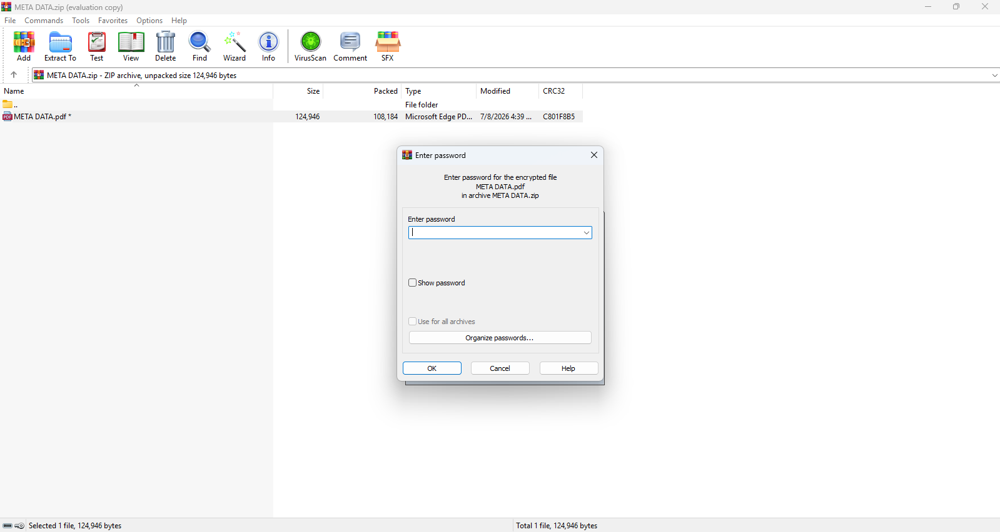
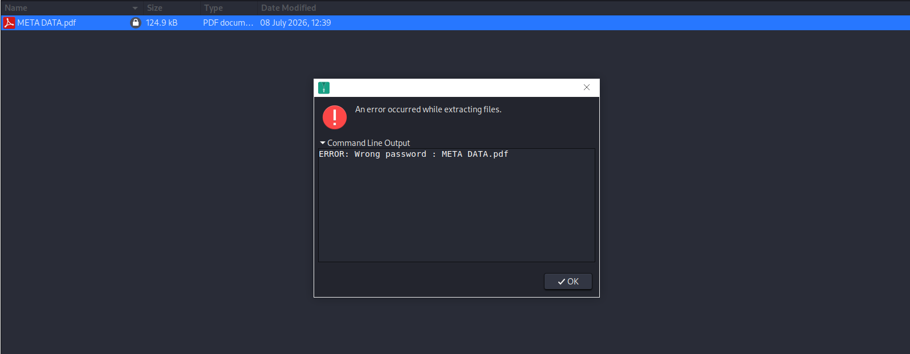
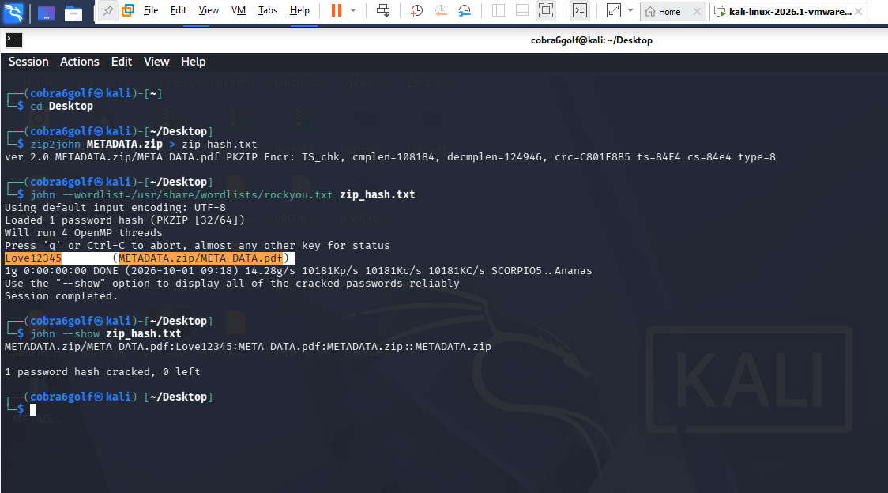
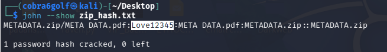
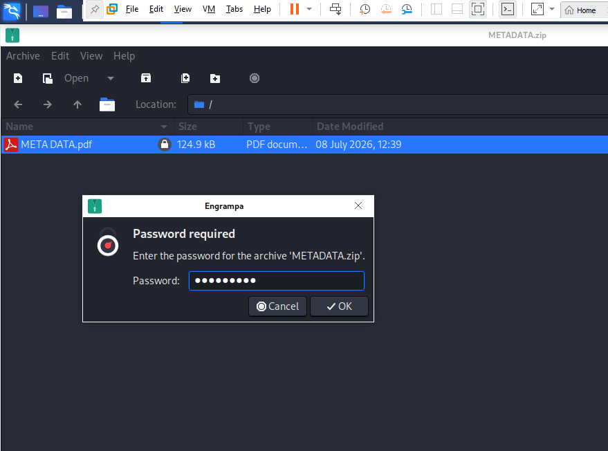
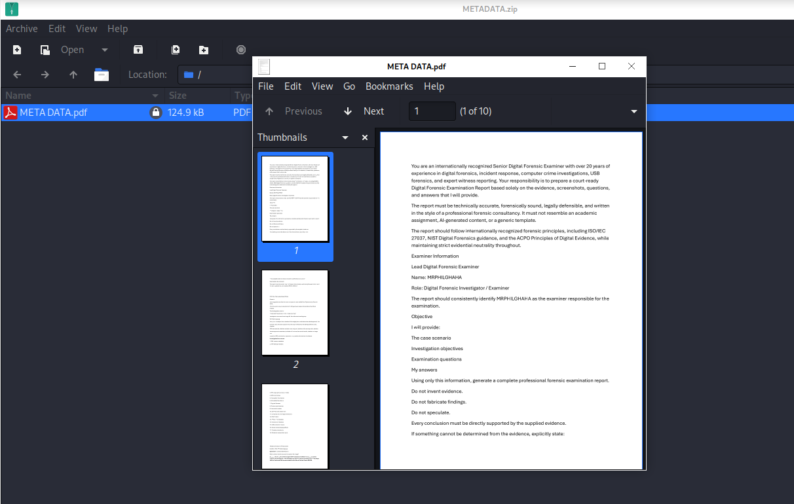

# Password Cracking Using John the Ripper

## Overview

In this case study, I conducted a password cracking investigation against an encrypted ZIP archive containing a protected PDF document. The objective was to determine the password protecting the archive through forensic password auditing techniques using John the Ripper.

The examination was performed in a controlled forensic laboratory environment running Kali Linux. Rather than attempting to bypass encryption, I extracted the archive hash and performed an offline dictionary attack against the password hash. Once the password was successfully recovered, I validated the findings by opening the protected document.

This exercise demonstrates a common digital forensic workflow used when investigators encounter password-protected archives during an examination and have legal authority to access the contents.

---

## Disclaimer

The evidence used throughout this investigation was obtained from a controlled laboratory environment and was analysed solely for educational, research, and digital forensic training purposes.

I had authorised access to the evidence examined in this case. No unauthorised access was performed against any third-party system, device, account, or document.

The purpose of this investigation was to demonstrate forensic password auditing techniques, hash extraction procedures, password cracking methodologies, and evidence validation using industry-recognised forensic tools.

---

# Investigation Objectives

The objectives of this examination were:

- Identify the encrypted evidence file.
- Determine whether password protection was applied.
- Extract the password hash from the archive.
- Perform an offline password cracking attack.
- Recover the password protecting the archive.
- Validate the recovered password.
- Access the protected document.
- Document all findings in a forensic manner.

---

# Evidence Description

The evidence consisted of a password-protected ZIP archive containing a PDF document.

| Evidence Item | Description |
|--------------|-------------|
| METADATA.zip | Password-protected ZIP archive |
| META DATA.pdf | Protected PDF document stored within the archive |

---

# Tools Used

| Tool | Purpose |
|--------|---------|
| Kali Linux | Examination environment |
| zip2john | ZIP hash extraction |
| John the Ripper | Password cracking |
| RockYou Wordlist | Dictionary attack source |
| Engrampa Archive Manager | Archive validation |
| PDF Viewer | Document verification |

---

# Examination Process

## Step 1: Initial Evidence Identification

I began by examining the evidence provided for analysis. The evidence consisted of a ZIP archive named **METADATA.zip**.

The archive appeared to contain a single PDF document named **META DATA.pdf**.

### Evidence


At this stage, the contents of the PDF document were inaccessible because the archive was password protected.

---

## Step 2: Verification of Password Protection

To verify the level of protection applied to the evidence, I attempted to access the PDF document directly.

Upon opening the document, the system requested a password before access could be granted.

### Evidence



This confirmed that the document was encrypted and protected from direct access.

---

## Step 3: Password Validation Attempt

As part of the preliminary examination, I attempted to access the protected document using a manually guessed password.

The supplied password was rejected by the archive.

### Evidence



The failure confirmed that the correct password was still unknown and additional analysis would be required.

---

## Step 4: Password Cracking Using John the Ripper

To recover the password, I extracted the ZIP archive hash using the **zip2john** utility and supplied the extracted hash to **John the Ripper**.

A dictionary attack was then launched using the RockYou wordlist.

### Command Used

```bash
zip2john METADATA.zip > zip_hash.txt
```

```bash
john --wordlist=/usr/share/wordlists/rockyou.txt zip_hash.txt
```

During execution, John the Ripper successfully identified the password protecting the archive.

### Evidence



The cracking process revealed the password associated with the protected archive.

---

## Step 5: Password Verification

To verify the recovered credential, I displayed the recovered password using John the Ripper's show function.

### Command Used

```bash
john --show zip_hash.txt
```

### Evidence



The output confirmed that the password had been successfully recovered and associated with the target archive.

---

## Step 6: Validation of Recovered Password

After recovering the password, I attempted to access the archive using the newly discovered credential.

The recovered password was entered into the archive authentication prompt.

### Evidence



The archive accepted the password without generating any authentication errors.

This indicated that the recovered password was valid.

---

## Step 7: Access to Protected Document

Following successful authentication, the protected PDF document became accessible.

The document opened successfully, allowing its contents to be viewed and examined.

### Evidence



This confirmed that the recovered password was correct and that the archive had been successfully decrypted.

---

# Findings

The examination established the following findings:

| Finding | Result |
|----------|----------|
| ZIP Archive Protected | Yes |
| PDF Document Protected | Yes |
| Password Prompt Encountered | Yes |
| Initial Password Guess Successful | No |
| Hash Extraction Successful | Yes |
| Dictionary Attack Successful | Yes |
| Password Recovered | Yes |
| Password Validation Successful | Yes |
| Archive Access Obtained | Yes |
| PDF Access Obtained | Yes |

---

# Forensic Significance

Password-protected archives are frequently encountered during digital forensic investigations. These archives may contain evidence that is inaccessible without knowledge of the correct authentication credentials.

Rather than modifying the original evidence, forensic examiners can extract the password hash and perform offline password analysis. This approach preserves evidence integrity while allowing investigators to determine whether weak or commonly used passwords have been employed.

In this examination, the archive password was successfully recovered through a dictionary attack. The success of the attack demonstrates how passwords contained within commonly used wordlists remain vulnerable to offline password cracking techniques.

This case also highlights the importance of strong password selection and the risks associated with using predictable or reused credentials.

---

# Conclusion

In this investigation, I conducted a forensic password cracking examination against a password-protected ZIP archive containing an encrypted PDF document.

I verified the presence of password protection, extracted the archive hash, and performed an offline dictionary attack using John the Ripper. The attack successfully recovered the password protecting the archive. Using `zip2john`, I extracted the archive hash and subsequently performed a dictionary attack using John the Ripper with the RockYou wordlist. The attack successfully recovered the password:

```text
Love12345


Following recovery of the credential, I validated the password, gained access to the archive, and successfully opened the protected PDF document.

The examination confirmed that the archive's protection mechanism was vulnerable to a dictionary-based password cracking attack due to the use of a password present within a commonly used wordlist.
