# Windows Shutdown and Startup Forensic Analysis

## Table of Contents

- Executive Summary
- Objective
- Evidence Sources
- Methodology
- Registry Analysis
  - Loading the SYSTEM Hive
  - Windows Shutdown Artifact
  - Current Control Set Verification
  - Shutdown Timestamp Interpretation
- Event Log Analysis
  - Reviewing System.evtx
  - Applying Event Filters
  - Filtered Results
- Important Event IDs
  - Event ID 1074 - User32
  - Event ID 13 - Kernel-General
  - Event ID 6005 - Event Log Service Started
  - Event ID 6006 - Event Log Service Stopped
  - Event ID 41 - Kernel-Power
  - Event ID 6008 - Unexpected Shutdown
- Timeline Reconstruction
- Findings
- Conclusion

---

# Executive Summary

Windows keeps a lot of little records of what a computer has been doing including when it started up, when it shut down, and whether anything went wrong along the way. These records matter a lot in forensic investigations because they help build a timeline and show how a system was actually used.

This write-up focuses on finding shutdown and startup evidence in two places, the SYSTEM Registry Hive and the System Event Log. The goal was to figure out when the computer was last shut down, whether that shutdown was normal or not, and what evidence backs that up.

When you combine what the Registry says with what the Event Log says, you can double-check timestamps against each other and build a timeline you can actually trust instead of relying on just one source.

---

# Objective

The objectives of this examination were to:

- Identify Windows shutdown events.
- Identify Windows startup events.
- Determine whether shutdowns were normal or abnormal.
- Examine Registry artifacts associated with shutdown activity.
- Examine Windows Event Logs associated with power events.
- Correlate multiple artifacts to validate findings.
- Reconstruct a timeline of startup and shutdown activity.

---

# Evidence Sources

The following artifacts were examined during this investigation:

| Artifact | Purpose |
|-----------|----------|
| SYSTEM Registry Hive | Shows the last shutdown timestamp |
| System.evtx | Shows startup and shutdown events |
| User32 Events | Shows shutdowns started by a user |
| Kernel-General Events | Shows OS-level shutdown activity |
| Event Log Service Events | Confirms startup and shutdown |
| Kernel-Power Events | Flags unexpected shutdowns |

---

# Methodology

Here's the process I followed, step by step:

1. Load the SYSTEM registry hive into Registry Explorer.
2. Locate and decode shutdown-related Registry artifacts.
3. Examine the System Event Log.
4. Filter startup and shutdown-related Event IDs.
5. Identify relevant shutdown events.
6. Correlate Registry timestamps with Event Log timestamps.
7. Interpret findings and reconstruct a timeline.
8. Document observations and conclusions.

---

# Registry Analysis

Registry artifacts are often one of the most reliable sources of evidence because they are maintained directly by the operating system and can provide timestamps that survive reboots.

## Loading the SYSTEM Hive

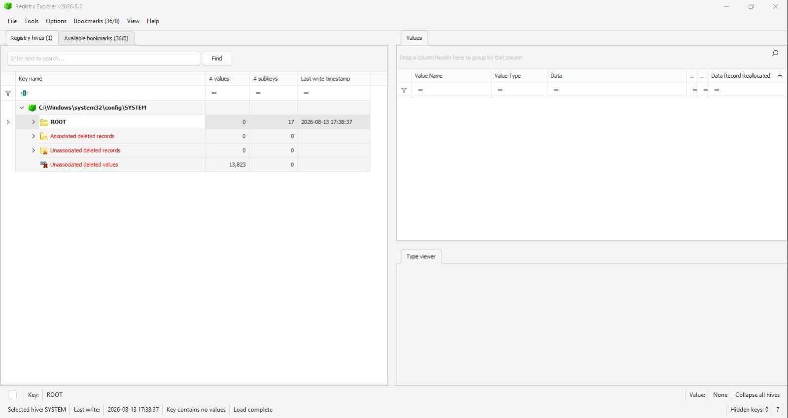

I loaded the SYSTEM Registry Hive into Registry Explorer to start examining it. The SYSTEM hive stores the operating system's configuration info, along with several artifacts related to startup and shutdown. This is one of the first places investigators look when trying to piece together a system timeline.

---

## Windows Shutdown Artifact

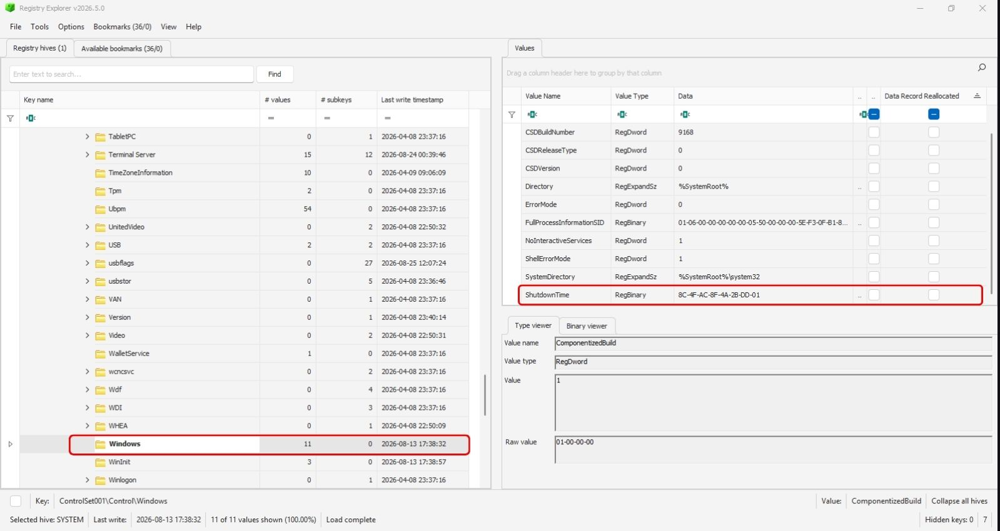

Inside the Windows key, there's a value called **ShutdownTime.** This records the most recent time Windows shut down successfully. This is a commonly used artifact in forensics, because it gives you direct and a solid proof that a shutdown actually happened.

---

## Current Control Set Verification

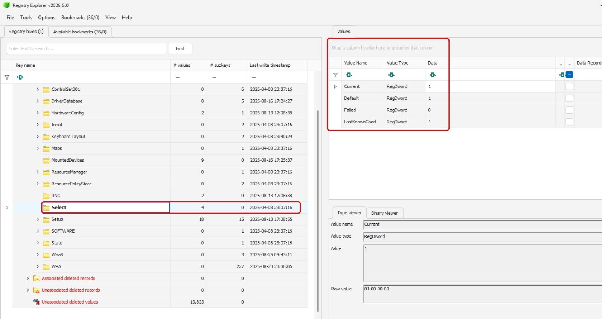

Before trusting any of the Registry data, I checked which control set was actually active. Windows keeps more than one control set stored at a time. If you analyze the wrong one, you could end up drawing conclusions based on old, outdated settings instead of what the system was actually doing. 

So confirming the active control set first is an important step, not something to skip.

---

## Shutdown Timestamp Interpretation

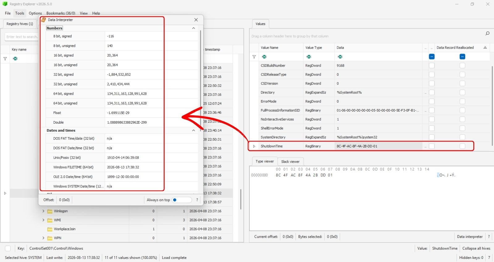

I used Registry Explorer's Data Interpreter to decode the ShutdownTime value. Once decoded, this timestamp shows the last time Windows successfully shut down..

### Why This Matters

The ShutdownTime artifact provides:

- Evidence of system shutdown activity.
- A timestamp for timeline reconstruction.
- Corroborative evidence when compared with Event Logs.
- Validation that the operating system completed a shutdown sequence.

---

# Event Log Analysis

While Registry artifacts provide shutdown timestamps, Event Logs provide context explaining how and why those shutdowns occurred. Windows records thousands of events every day, making filtering essential during forensic investigations.

---

## Reviewing System.evtx

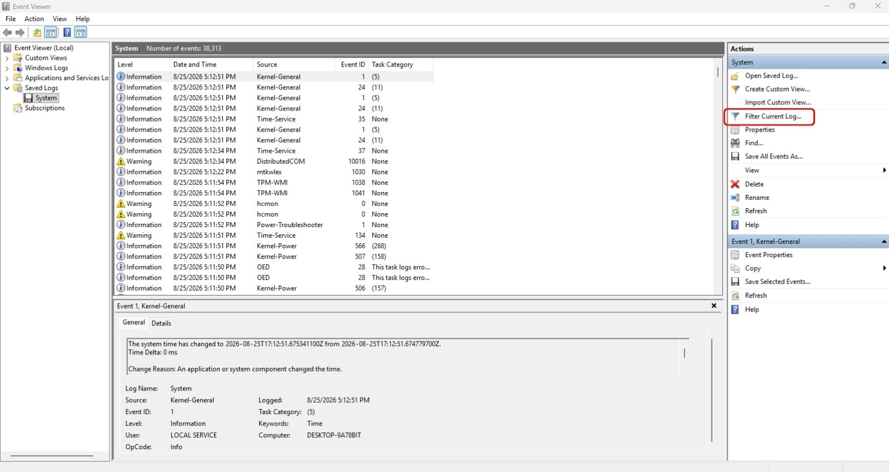

At first, the System Event Log was packed with thousands of entries generated by Windows services, drivers, apps, and other OS components. Trying to find shutdown-related events in all that noise, without filtering first, would be nearly impossible and difficult.

---

## Applying Event Filters

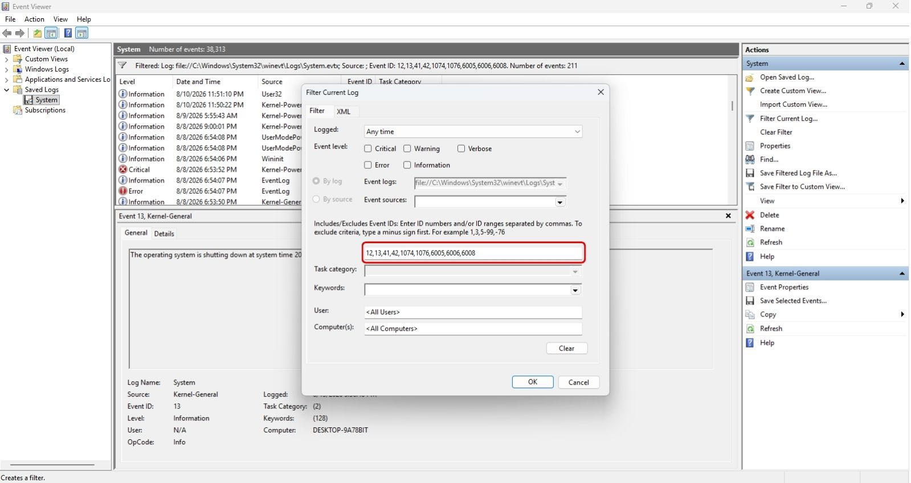

I applied a filter to isolate just the Event IDs tied to startup, shutdown, power events, and system state changes. Filtering cuts out the noise and lets you focus only on what's actually relevant to the shutdown investigation.

---

## Filtered Results

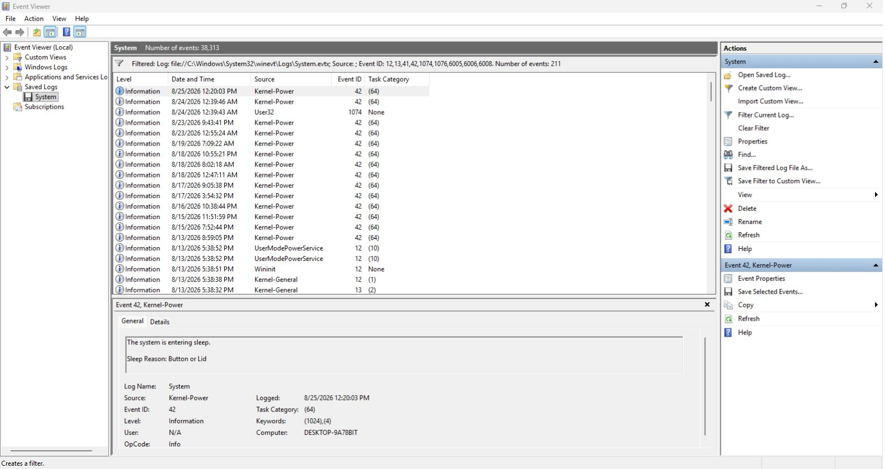

After filtering, only shutdown and startup-related events remained visible.

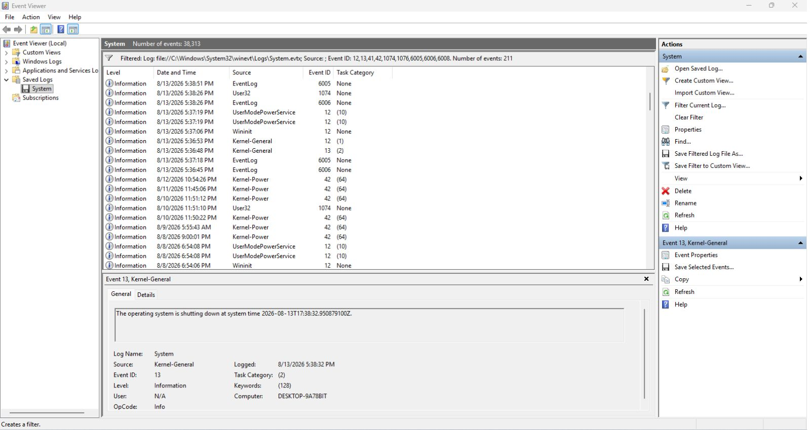

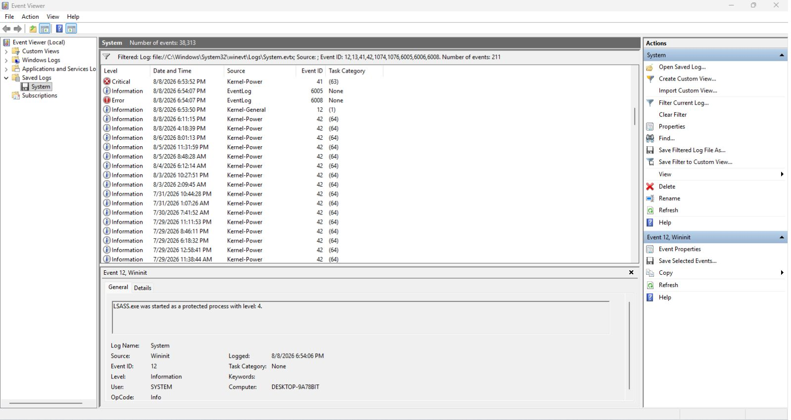

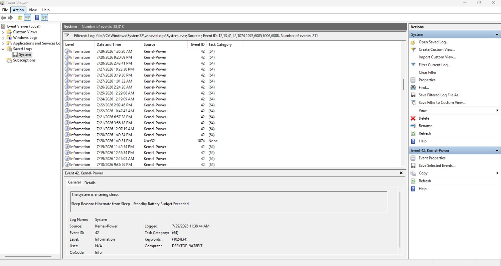

These filtered results became the foundation for building the timeline.

---

# Important Event IDs

Several Event IDs are particularly valuable when performing shutdown investigations.

---

## Event ID 1074 – User32

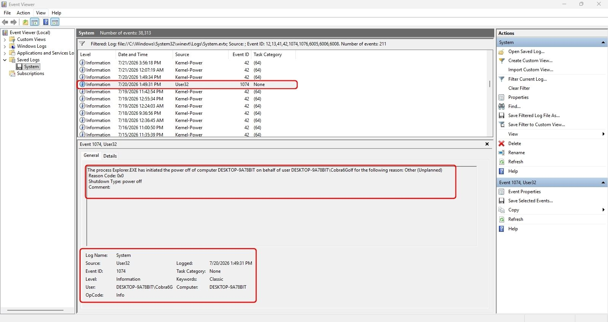

Event ID 1074 is generated whenever a user, process, or application initiates a shutdown or restart operation.

### Why Investigators Care

This event may reveal:

- The user responsible.
- The process responsible.
- The reason for the shutdown.
- Whether the action was a shutdown or restart.

### Investigative Value

This event helps answer:

> Who initiated the shutdown?

This makes it one of the most valuable artifacts during user attribution investigations.

---

## Event ID 13 – Kernel-General

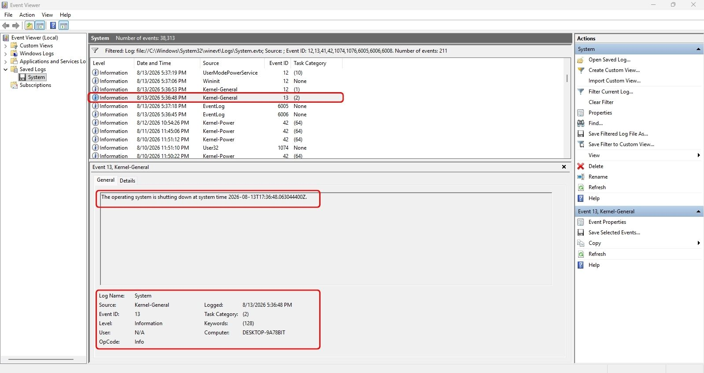

Kernel-General events record important operating system activities including shutdown-related information.

### Why Investigators Care

Event ID 13 often assists with:

- Timeline reconstruction.
- Timestamp validation.
- Correlation with Registry artifacts.

### Investigative Value

This event can confirm when Windows began the shutdown process.

---

## Event ID 6005 – Event Log Service Started

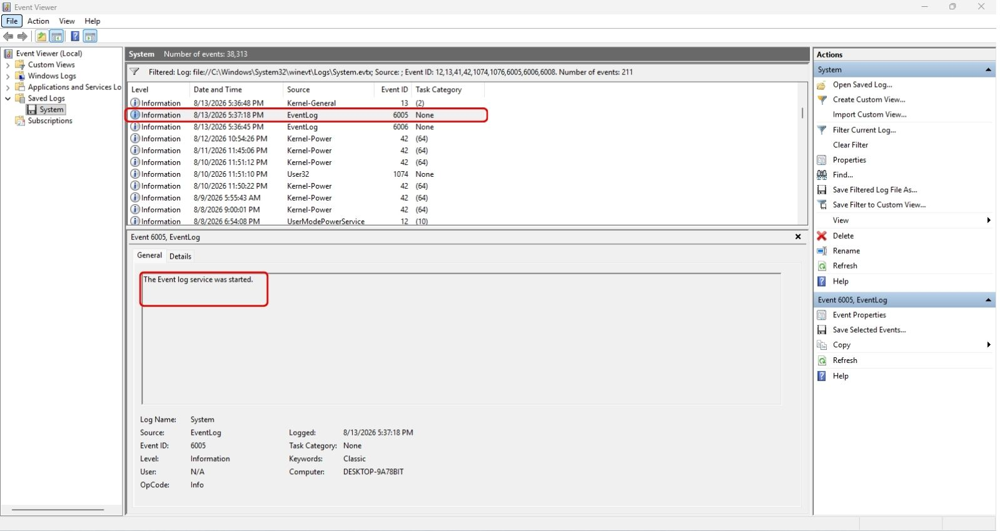

Event ID 6005 indicates that the Windows Event Log service has started.

### Why Investigators Care

Because the Event Log service starts during boot, this event serves as strong evidence that the operating system successfully started.

### Investigative Value

This event helps determine:

- System startup time.
- Beginning of a user session.
- Boot timeline reconstruction.

---

## Event ID 6006 – Event Log Service Stopped

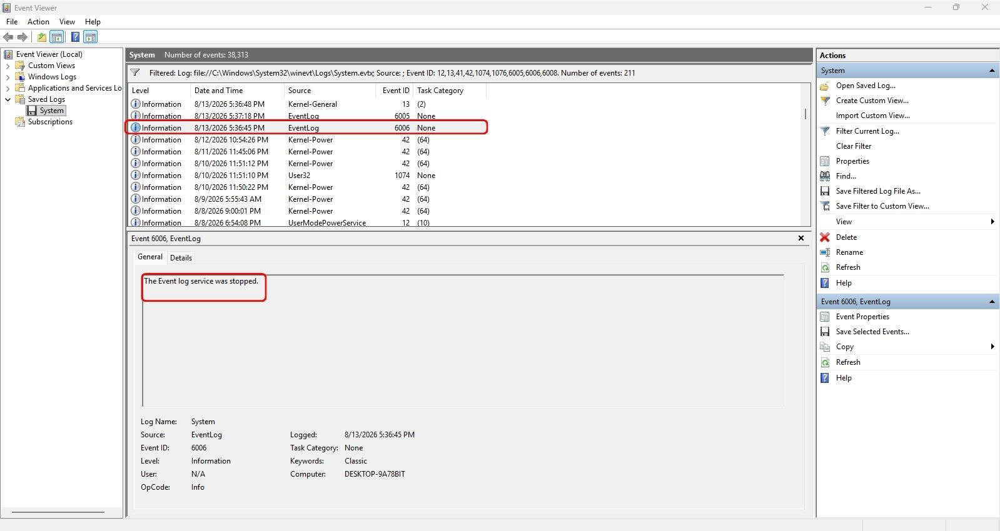

Event ID 6006 indicates that the Event Log service stopped normally.

### Why Investigators Care

This event is one of the strongest indicators of a clean shutdown.

### Investigative Value

This event confirms:

- Windows completed a shutdown sequence.
- No sudden power loss occurred during that shutdown.
- The shutdown was orderly and expected.

---

## Event ID 41 – Kernel-Power

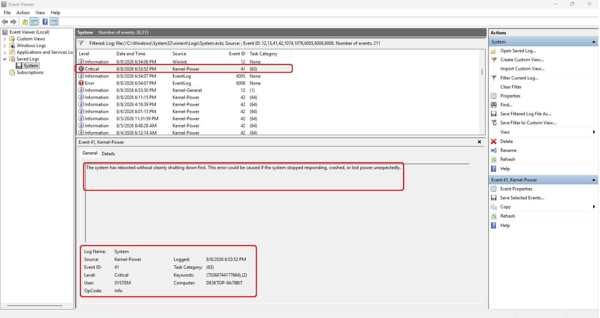

Event ID 41 is generated when Windows detects that the system restarted without first completing a proper shutdown.

### Possible Causes

- Power outage.
- Battery depletion.
- Forced power off.
- System crash.
- Hardware failure.

### Investigative Value

This event is often the first indication that something abnormal occurred.

---

## Event ID 6008 – Unexpected Shutdown

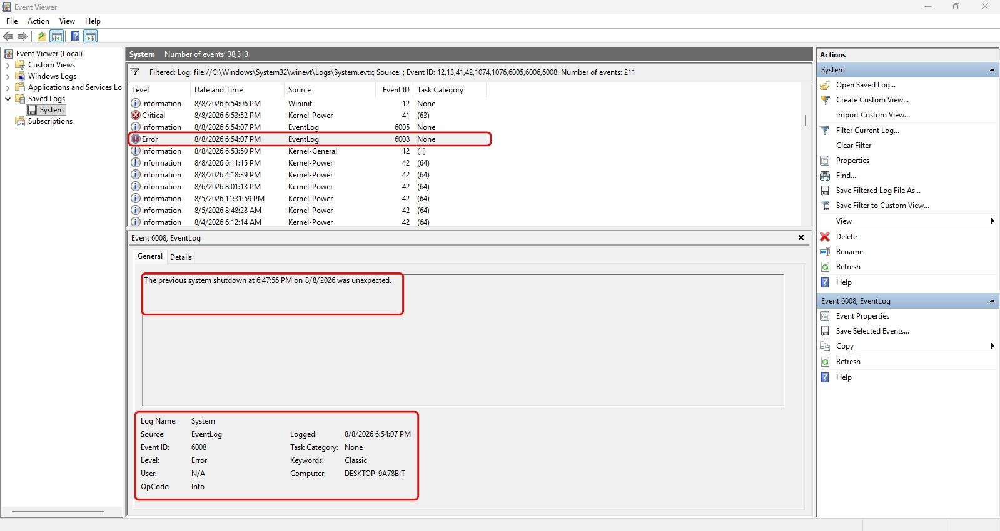

Event ID 6008 records that the previous shutdown was unexpected.

### Why Investigators Care

This event frequently appears alongside Event ID 41 and confirms that Windows did not complete a normal shutdown sequence.

### Investigative Value

This event may indicate:

- Power interruption.
- System instability.
- Crash activity.
- Forced shutdown behavior.

---

# Timeline Reconstruction

To ensure accuracy, Registry artifacts and Event Logs should always be correlated.

| Event ID | Description | Interpretation |
|-----------|-------------|---------------|
| Registry ShutdownTime | Registry Artifact | Last successful shutdown |
| 1074 | User32 | User initiated shutdown |
| 13 | Kernel-General | Shutdown process started |
| 6006 | Event Log | Clean shutdown |
| 6005 | Event Log | System startup |
| 41 | Kernel-Power | Improper shutdown |
| 6008 | Event Log | Unexpected shutdown |

Looking at several artifacts together and instead of just one, allows you double-check your evidence and avoid drawing conclusions from a single, possibly misleading source.

---

# Findings

The examination revealed the following:

1. The SYSTEM Registry Hive contained a valid ShutdownTime artifact.
2. Registry Explorer successfully decoded the shutdown timestamp.
3. Event ID 1074 provided evidence of user or process initiating a shutdown activity.
4. Event ID 13 documented operating system shutdown activity.
5. Event ID 6005 confirmed system startup events.
6. Event ID 6006 confirmed clean shutdown events.
7. Event ID 41 identified improper shutdown activity.
8. Event ID 6008 confirmed unexpected shutdowns had occurred.
9. Registry and Event Log artifacts corroborated one another and supported timeline reconstruction.

---

# Conclusion

Investigating Windows shutdowns properly means looking at multiple artifacts together, not just one, to build a full and accurate picture of what happened.

The SYSTEM Registry Hive gives you proof of the last successful shutdown through its ShutdownTime value. The System Event Log fills in the context explaining how and why that shutdown happened.

By comparing the Registry data against Event IDs 1074, 13, 6005, 6006, 41, and 6008, you can tell the difference between a normal shutdown, a shutdown a user actually chose to do, an unexpected shutdown, a crash, or a power failure.

This investigation shows why cross-checking artifacts matters, and how Windows Registry data and Event Logs work together to build a forensic timeline you can actually rely on.
