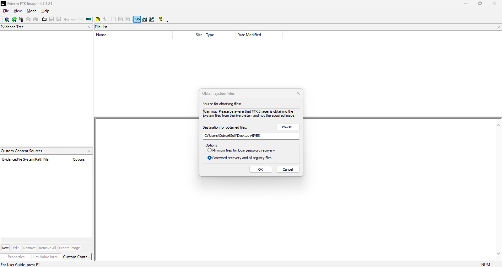

# Shellbags-Host-Based-Forensics

A Windows host-based Shellbags investigation performed against an extracted `UsrClass.dat` Registry hive to identify folder and drive activity, examine Shellbag metadata, review timestamps, and determine what the artifact can and cannot prove.

## Case Information

| Property | Value |
|---|---|
| Investigation Type | Windows Shellbags Forensics |
| Evidence | Windows Registry Hive |
| Evidence Name | `UsrClass.dat` |
| Primary Tool | ShellBags Explorer v2.1.0 |
| Acquisition Tool | FTK Imager v4.7.3.81 |
| Hashing Tool | Sherlock Forensics |
| Primary Artifact | Shellbags |
| Analyst | **PHILIP OPPONG ADANSE** |
| Status | In Progress |
| Classification | Training Exercise |

## Table of Contents

1. [Evidence Acquisition](#1-evidence-acquisition)
2. [Hash Generation](#2-hash-generation)
3. [Hash Verification](#3-hash-verification)
4. [Open ShellBags Explorer](#4-open-shellbags-explorer)
5. [Load the Evidence](#5-load-the-evidence)
6. [Shellbag Parsing](#6-shellbag-parsing)
7. [Identify Interesting Entries](#7-identify-interesting-entries)
8. [Analyze E: Drive](#8-analyze-e-drive)
9. [Analyze E:\new new](#9-analyze-enew-new)
10. [Timestamp Analysis](#10-timestamp-analysis)
11. [Findings](#11-findings)
12. [Conclusion](#12-conclusion)

## 1. Evidence Acquisition

At 04:25, I extracted the Registry hive using FTK Imager v4.7.3.81. The file extracted for this investigation was: `UsrClass.dat`

The purpose of this step was for me to obtain the Registry hive for forensic analysis while keeping the original evidence unchanged.

## Acquisition Details

| Property | Value |
|---|---|
| Evidence | `UsrClass.dat` |
| Acquisition Tool | FTK Imager v4.7.3.81 |
| Acquisition Time | 04:25 |
| Analyst | **PHILIP OPPONG ADANSE** |

`Figure 1. Registry hive extraction using FTK Imager`

## 2. Hash Generation

At 04:33, I generated hash values for the extracted `UsrClass.dat` file using Sherlock Forensics. Hashing gives us a way to check whether the evidence has changed during the investigation.

### Hash Values

| Hash Type | Value |
|---|---|
| MD5 | `210c8ab2b2a2fb41615608e166e4a893` |
| SHA-256 | `fc4bddcdbb84dc20c968cc8dae66c903c628b14bd5e5f17af87bdc508b99cd4a` |

`Figure 2. Hash generation using Sherlock Forensics`

## 3. Hash Verification

At 04:35, I verified the SHA-256 hash of the extracted `UsrClass.dat` file. The verification showed that the calculated SHA-256 hash matched the reference hash generated earlier.

### Verification Result

**INTEGRITY VERIFIED - SHA-256 MATCH**

The verified SHA-256 value was: `fc4bddcdbb84dc20c968cc8dae66c903c628b14bd5e5f17af87bdc508b99cd4a`

This confirms that the `UsrClass.dat` file used for the examination matched the file that was previously hashed.

`Figure 3. SHA-256 hash verification`

## 4. Open ShellBags Explorer

At 04:37, I opened ShellBags Explorer v2.1.0 to begin examining the Shellbag artifacts from the extracted Registry hive. ShellBags Explorer was used to parse and display the Shellbag records found in the `UsrClass.dat` file.

`Figure 4. ShellBags Explorer v2.1.0`

## 5. Load the Evidence

At 04:38, I loaded the extracted `UsrClass.dat` file into ShellBags Explorer. The tool processed the Registry hive and displayed the Shellbag records found in the file. The `UsrClass.dat` file was used as the source for the Shellbag analysis.

**Figure 5.  `UsrClass.dat`  loaded into ShellBags Explorer**

