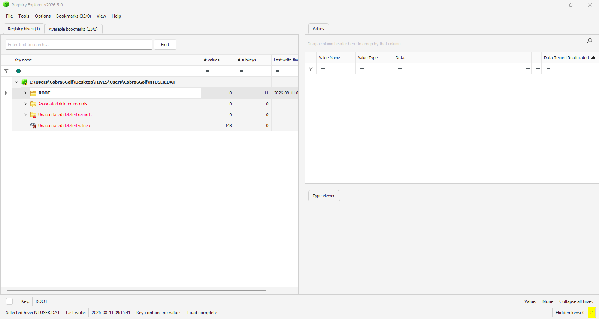
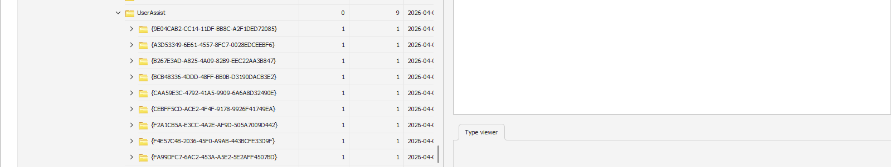
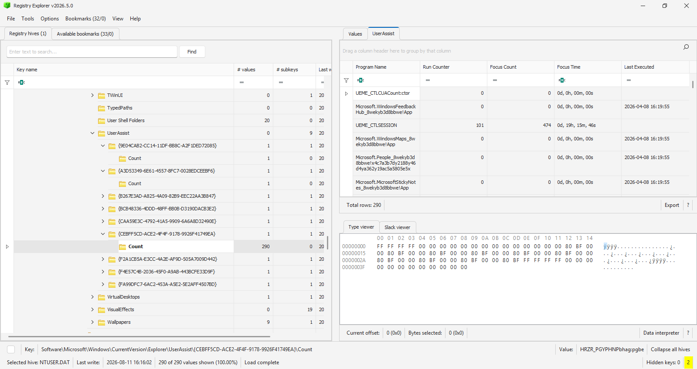
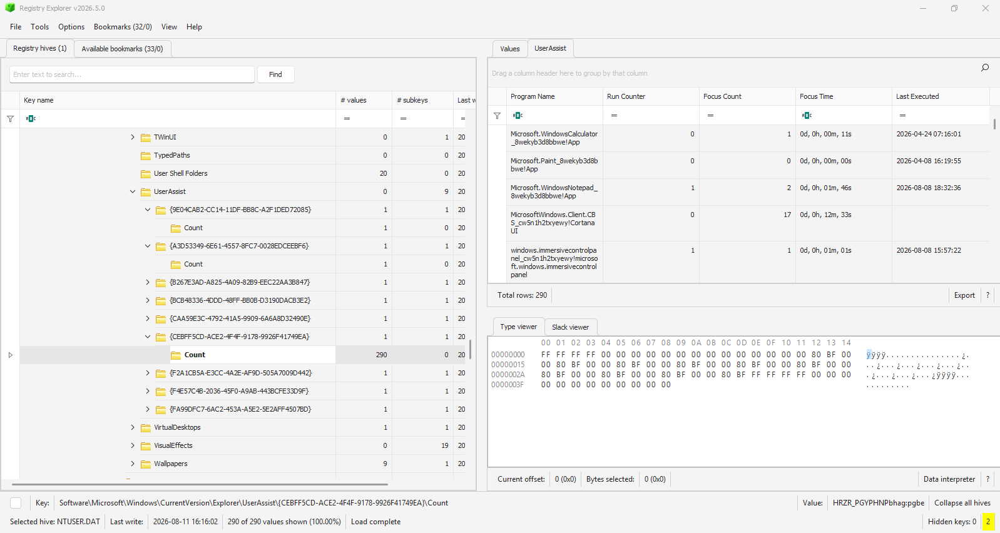

# UserAssist-Host-Based-Forensics

I performed a Windows host-based UserAssist investigation against an extracted `NTUSER.DAT` Registry hive to identify program execution activity, execution frequency, focus time and last execution timestamps using Registry Explorer.

> [!IMPORTANT]
> **Disclaimer**
>
> This case study was completed as part of a digital forensics training exercise for educational and portfolio purposes.
>
> The evidence, artifacts and findings presented in this repository are intended to demonstrate forensic methodology, evidence handling, artifact analysis and reporting techniques.
>
> This exercise was performed in a controlled laboratory environment.
>
> This repository does not contain legal opinions and should not be interpreted as evidence of criminal activity.

## Case Information

| Property | Value |
|-----------|---------|
| Investigation Type | UserAssist Analysis |
| Evidence | NTUSER.DAT |
| Primary Tool | Registry Explorer |
| Artifact | UserAssist |
| Analyst | Philip Oppong Adanse |
| Status | Completed |

## Skills Demonstrated

- Registry Hive Analysis
- Evidence Preservation
- Hash Verification
- UserAssist Analysis
- Program Execution Analysis
- Timeline Reconstruction
- Forensic Documentation
- Report Writing

## Tools Used

| Tool | Version |
|--------|--------|
| FTK Imager | 4.7.3.81 |
| Sherlock Forensics | Web Application |
| Registry Explorer | Current Release |

## Table of Contents

## Table of Contents

1. [Evidence Acquisition](#1-evidence-acquisition)
2. [Hash Generation](#2-hash-generation)
3. [Hash Verification](#3-hash-verification)
4. [Load NTUSERDAT](#4-load-ntuserdat)
5. [Navigate to UserAssist](#5-navigate-to-userassist)
6. [Examine UserAssist Entries](#6-examine-userassist-entries)
7. [Windows Explorer Activity](#7-windows-explorer-activity)
8. [Notepad Activity](#8-notepad-activity)
9. [Key Timeline](#9-key-timeline)
10. [Findings](#10-findings)
11. [Limitations](#11-limitations)
12. [Conclusion](#12-conclusion)


---

## 1. Evidence Acquisition

The `NTUSER.DAT` Registry hive was extracted from my Windows system using FTK Imager v4.7.3.81. The extraction was performed at **15:50 UTC** to preserve the artifact for forensic examination.

### Evidence Information

| Property | Value |
|-----------|---------|
| Evidence Type | Registry Hive |
| Hive Name | NTUSER.DAT |
| Acquisition Tool | FTK Imager v4.7.3.81 |
| Acquisition Time | 15:50 UTC |
| Examiner | Philip Oppong Adanse |

### Figure 1. NTUSER.DAT Extraction


---

## 2. Hash Generation

To ensure evidence integrity, hash values were generated for the extracted `NTUSER.DAT` file using Sherlock Forensics. Hash generation was performed at **15:54 UTC**.

### Generated Hash Values

| Algorithm | Hash Value |
|-----------|-----------|
| MD5 | 1b8a47485bf13a0e188a06b4be3de726 |
| SHA256 | 19908a4698d6213170d42cd31f7ae25f62c10938d36c27b4484457e658fb5cdd |

### Figure 2. Hash Generation


---

## 3. Hash Verification

The generated hash values were verified before analysis to confirm that the evidence had not been modified. Hash verification was completed at **15:57 UTC**.

### Verification Result

| Status | Result |
|----------|----------|
| MD5 Verification | Successful |
| SHA256 Verification | Successful |
| Evidence Integrity | Verified |

The matching hash values confirmed that the evidence remained unchanged throughout the acquisition process.

### Figure 3. Hash Verification


---

## 4. Load NTUSER.DAT

I launched the Registry Explorer v2026.5.0 and the extracted `NTUSER.DAT` hive which was loaded for examination. The hive was loaded at **15:58 UTC**.

### Figure 4. NTUSER.DAT Loaded in Registry Explorer




---

## 5. Navigate to UserAssist

After loading the `NTUSER.DAT` hive into Registry Explorer, i moved to examine the UserAssist artifact. The following Registry path was analyzed:

```text
Software\Microsoft\Windows\CurrentVersion\Explorer\UserAssist
```

UserAssist is a Windows Registry artifact that records information about applications executed through the Windows graphical user interface (GUI).

The artifact can provide valuable information including:

- Program Name
- Run Count
- Focus Count
- Focus Time
- Last Execution Time

Two UserAssist GUID containers were identified within the Registry hive. These containers store execution information for applications launched by the user.

### Figure 5. UserAssist Registry Path




---

## 6. Examine UserAssist Entries

The UserAssist entries were examined to identify applications executed by the user. Registry Explorer automatically decoded the UserAssist entries, allowing the application names and execution details to be viewed.

The analysis revealed multiple executed applications, including system utilities and user applications.

Information available within the UserAssist entries included:

- Application Name
- Run Counter
- Focus Count
- Focus Time
- Last Execution Timestamp

### Figure 6. UserAssist Entries




---

## 7. Windows Explorer Activity

One of the UserAssist entries i identified during analysis was **Windows Explorer**. Windows Explorer is the primary file management application in Windows and its presence within UserAssist indicated interaction through the graphical user interface.

### Execution Details

| Property | Value |
|-----------|---------|
| Application | Windows Explorer |
| Run Counter | 21 |
| Focus Count | 36 |
| Focus Time | 21 Minutes 24 Seconds |
| Last Executed | 2026-08-11 12:46:13 |

The UserAssist record indicates that Windows Explorer was executed multiple times and remained in focus for an accumulated duration of approximately 21 minutes.

### Figure 7. Windows Explorer UserAssist Entry



---

## 9. Key Timeline

The table below summarizes the most relevant timestamps recovered from the UserAssist artifact.

| Event | Timestamp (UTC) |
|---------|---------|
| Calculator Last Executed | 2026-04-24 07:16:01 |
| Command Prompt Last Executed | 2026-05-14 11:06:30 |
| Notepad Last Executed | 2026-08-08 18:32:36 |
| Windows Explorer Last Executed | 2026-08-11 12:46:13 |

### Timeline Interpretation

The UserAssist artifact indicated a history of application execution activity on the system. Windows Explorer showed the highest level of interaction, recording multiple executions and the longest focus duration. The artifact also recorded execution of Notepad, Command Prompt and Calculator at various points in time.

UserAssist timestamps provide evidence of application execution through the Windows graphical user interface and can assist investigators in reconstructing user activity.


---

## 10. Findings

Analysis of the UserAssist artifact identified evidence of application execution activity within the examined user profile.

The investigation identified the following applications:

| Application | Run Counter | Last Executed |
|-------------|------------|---------------|
| Windows Explorer | 21 | 2026-08-11 12:46:13 |
| Windows Notepad | 1 | 2026-08-08 18:32:36 |
| Command Prompt | Unknown | 2026-05-14 11:06:30 |
| Calculator | Unknown | 2026-04-24 07:16:01 |

The UserAssist records indicated that Windows Explorer was the most frequently used application observed during the examination. The artifact successfully provided execution timestamps, run counts and focus statistics for several applications associated with the user profile.

### Key Observations

- Windows Explorer recorded 21 executions.
- Windows Explorer accumulated approximately 21 minutes and 24 seconds of focus time.
- Notepad was executed at least once.
- Command Prompt execution was recorded.
- Calculator execution was recorded.
- UserAssist entries were successfully decoded and interpreted using Registry Explorer.


---

## 11. Limitations

UserAssist is also a valuable source of evidence for identifying application execution activity. However, several limitations should be considered. UserAssist can indicate that an application was executed but cannot determine:

- What actions were performed inside the application.
- What files were opened.
- What content was viewed or modified.
- Whether activity was legitimate or malicious.

For example, UserAssist confirmed that Notepad was executed but cannot determine what text was created, viewed or edited.

Additional artifacts such as Prefetch, Jump Lists, RecentDocs and LNK files should be examined to obtain a more complete understanding of user activity.
