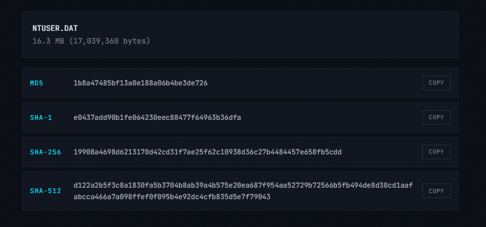
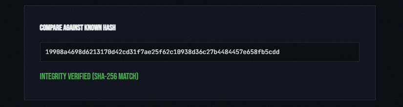
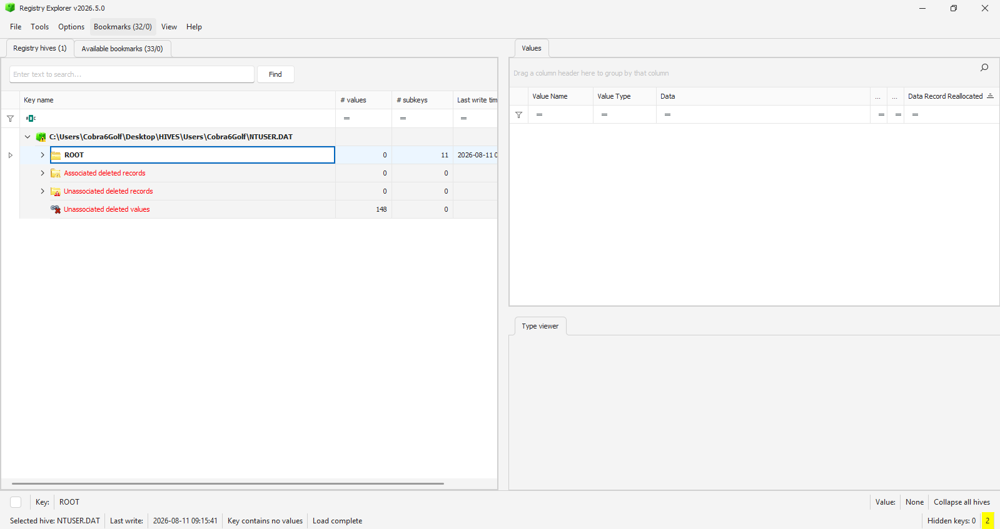
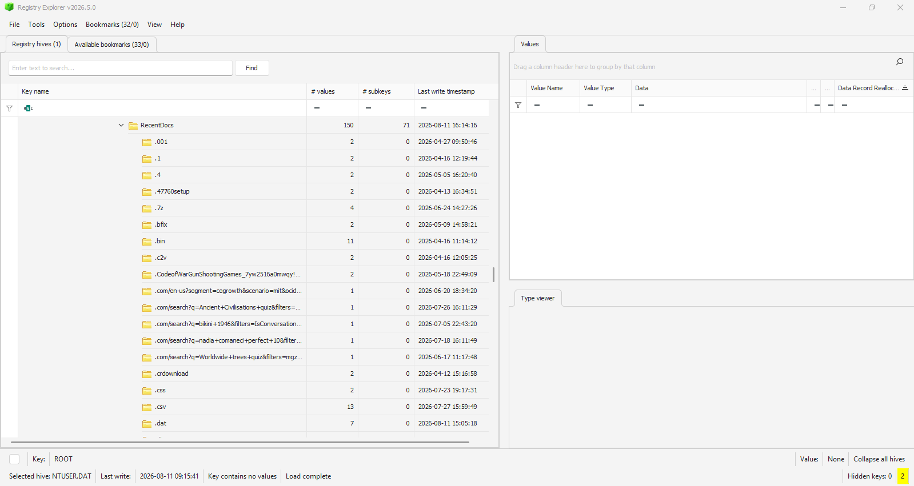
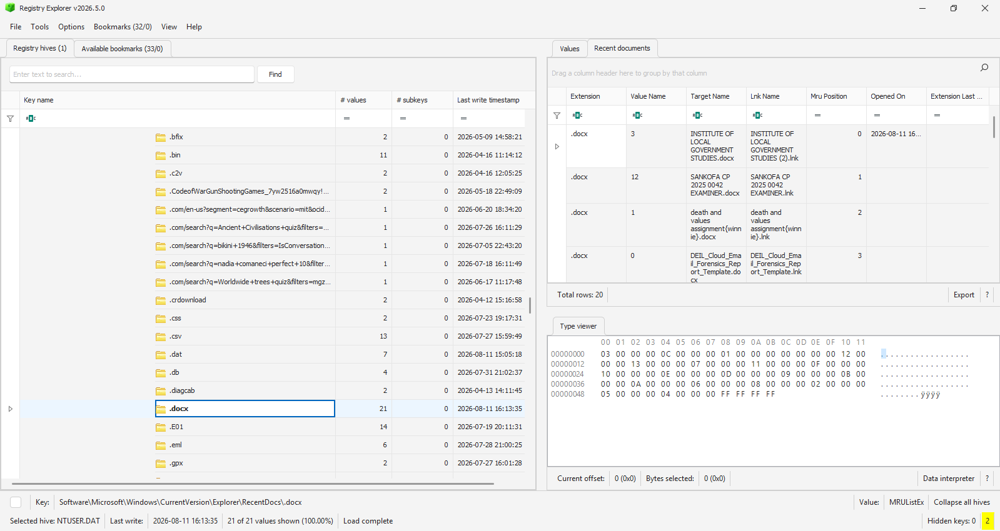
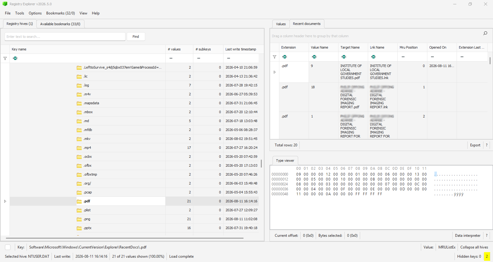
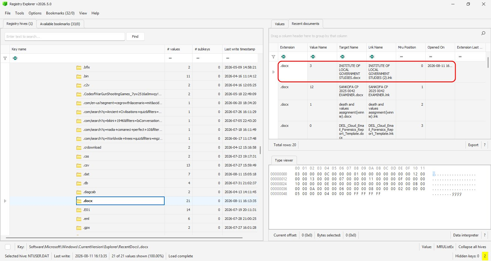
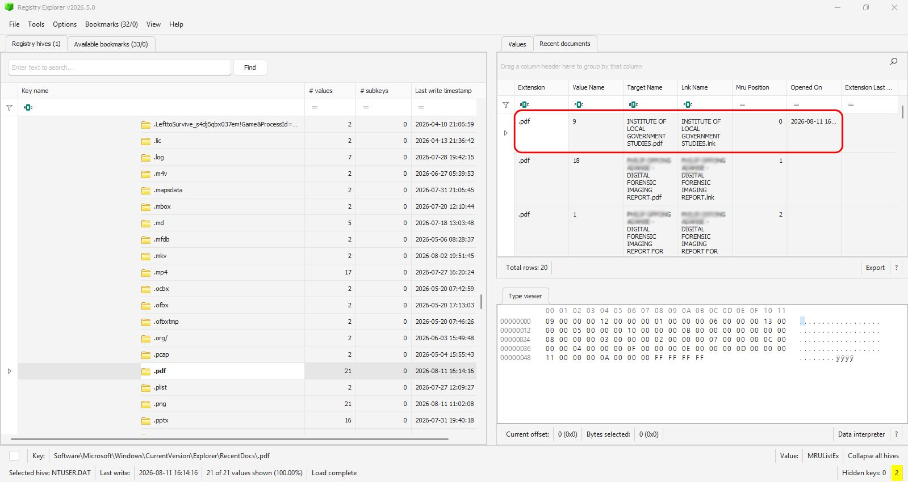

# RecentDocs-Host-Based-Forensics

A Windows host-based forensic investigation performed against an extracted NTUSER.DAT Registry hive to identify recently accessed files, examine file extension activity, and demonstrate the evidential value of the Windows RecentDocs artifact.

## Case Information

| Property | Value |
|----------|----------|
| Investigation Type | Windows RecentDocs Analysis |
| Evidence | NTUSER.DAT |
| Primary Tool | Registry Explorer v2026.5.0 |
| Operating System | Windows |
| Analyst | Philip Oppong Adanse |
| Status | Completed |

## Table of Contents

1. [Evidence Acquisition](#1-evidence-acquisition)
2. [Hash Generation](#2-hash-generation)
3. [Hash Verification](#3-hash-verification)
4. [Loading NTUSER.DAT](#4-loading-ntuserdat)
5. [Navigating to RecentDocs](#5-navigating-to-recentdocs)
6. [Examining RecentDocs Entries](#6-examining-recentdocs-entries)
7. [Recent File Type Analysis](#7-recent-file-type-analysis)
8. [Timeline Analysis](#8-timeline-analysis)
9. [Findings](#9-findings)
10. [Limitations](#10-limitations)
11. [Conclusion](#11-conclusion)

---

## 1. Evidence Acquisition

The NTUSER.DAT Registry hive was extracted from the target system using FTK Imager v4.7.3.81. The extracted hive was preserved as forensic evidence and used throughout this investigation.

### Figure 1. NTUSER.DAT Extraction


---

## 2. Hash Generation

Cryptographic hash values were generated for the extracted NTUSER.DAT file using Sherlock Forensics to establish evidence integrity. This helps to tell us as to whether the evidence has been altered or not.

| Algorithm | Hash Value |
|----------|----------|
| MD5 | 1b8a47485bf13a0e188a06b4be3de726 |
| SHA256 | 19908a4698d6213170d42cd31f7ae25f62c10938d36c27b4484457e658fb5cdd |

### Figure 2. Hash Generation



---

## 3. Hash Verification

The generated hash values were verified before analysis commenced. Verification confirmed that the NTUSER.DAT hive remained unchanged and suitable for forensic examination.

### Figure 3. Hash Verification



---

## 4. Loading NTUSER.DAT

The NTUSER.DAT hive was loaded into Registry Explorer v2026.5.0. Registry Explorer automatically parsed the hive structure and exposed available user activity artifacts for examination.

### Figure 4. NTUSER.DAT Loaded



---

## 5. Navigating to RecentDocs

The following Registry path was examined:

```text
Software\Microsoft\Windows\CurrentVersion\Explorer\RecentDocs
```

RecentDocs stores references to recently opened files and folders and organizes entries according to file extensions.

### Figure 5. RecentDocs Registry Key



---

## 6. Examining RecentDocs Entries

I examined the RecentDocs artifact to identify recently accessed documents recorded within the NTUSER.DAT Registry hive. Analysis of the `.docx` extension category revealed 21 recorded Microsoft Word document entries.

Observed document names included:

- INSTITUTE OF LOCAL GOVERNMENT STUDIES.docx
- SANKOFA CP 2025 0042 EXAMINER.docx
- death and values assignment.docx
- DEIL_Cloud_Email_Forensics_Report_Template.docx

The document **INSTITUTE OF LOCAL GOVERNMENT STUDIES.docx** was assigned an MRU (Most Recently Used) position of **0**, indicating it was the most recently recorded Word document within the examined category.

### Figure 6. DOCX Entries within RecentDocs



The `.pdf` extension category was also examined. Analysis revealed 21 recorded PDF document entries aswell.

Observed PDF entries included:

- INSTITUTE OF LOCAL GOVERNMENT STUDIES.pdf
- DIGITAL FORENSIC IMAGING REPORT.pdf
- DIGITAL FORENSIC IMAGING REPORT FOR ...

The document **INSTITUTE OF LOCAL GOVERNMENT STUDIES.pdf** was assigned an MRU position of **0**, indicating it was the most recently recorded PDF document within the examined category.

### Figure 7. PDF Entries within RecentDocs



---

## 7. Recent File Type Analysis

Examination of the RecentDocs artifact revealed a diverse range of file extension categories associated with user activity.

some examples i observed within the artifacts included:

- DOCX
- PDF
- PNG
- JPG
- PPTX
- CSV
- E01
- PCAP
- JSON
- ZIP
- LOG

The presence of these categories demonstrates that Windows recorded interactions with multiple file types across the user profile. Several of the observed file extensions are commonly associated with digital forensics, documentation, reporting, and technical analysis activities.

The artifact further revealed repeated interaction with Microsoft Word and PDF documents, suggesting these file formats were frequently accessed by the user.

---

## 8. Timeline Analysis

Registry timestamps associated with the RecentDocs entries provided useful contextual information regarding user activity. The `.docx` category recorded a Last Write timestamp of:

```text
2026-08-11 16:13:35
```



The `.pdf` category recorded a Last Write timestamp of:

```text
2026-08-11 16:14:16
```

These timestamps indicate RecentDocs activity occurring within approximately one minute of each other. Additionally, the most recent entries in both categories corresponded to files relating to the Institute of Local Government Studies, suggesting that documents of both formats were accessed during the same activity period.

### Figure 8. RecentDocs Timeline Evidence



---

## 9. Findings

The following findings were identified during examination of the RecentDocs artifact:

1. The NTUSER.DAT hive contained an active RecentDocs artifact.

2. Multiple file extension categories were present, demonstrating user interaction with numerous file types.

3. The `.docx` category contained 21 recorded entries.

4. The `.pdf` category contained 21 recorded entries.

5. The most recently recorded Word document was:

   ```text
   INSTITUTE OF LOCAL GOVERNMENT STUDIES.docx
   ```

6. The most recently recorded PDF document was:

   ```text
   INSTITUTE OF LOCAL GOVERNMENT STUDIES.pdf
   ```

7. Registry timestamps indicated that both document categories were updated on 11 August 2026 during the same activity period.

8. RecentDocs successfully preserved evidence of document interaction that may assist in reconstructing historical user activity.

---

## 10. Limitations

The RecentDocs artifact does not prove that a document was fully opened, viewed, edited, or read. RecentDocs only demonstrates that Windows recorded an interaction sufficient to create or update an entry within the artifact.

Investigators would need to correlate RecentDocs findings with additional artifacts such as the:

- Jump Lists
- LNK Files
- UserAssist
- Shellbags
- MRU Lists
- File System Metadata

to strengthen investigative conclusions.

---

## 11. Conclusion

Analysis of the Windows RecentDocs artifact successfully identified evidence of recent document activity within the examined user profile. The artifact revealed multiple document categories, including Microsoft Word and PDF files, and provided insight into recently recorded user interactions.

The examination demonstrated the forensic value of RecentDocs in identifying document-related activity and establishing investigative leads for further artifact correlation.

---

## Disclaimer

This case study was conducted in a controlled forensic laboratory environment for educational, research, and professional development purposes.

The findings presented are based solely on the artifacts examined and should not be interpreted beyond the evidential scope of the analyzed data. Conclusions should always be corroborated with additional forensic evidence and investigative context.


